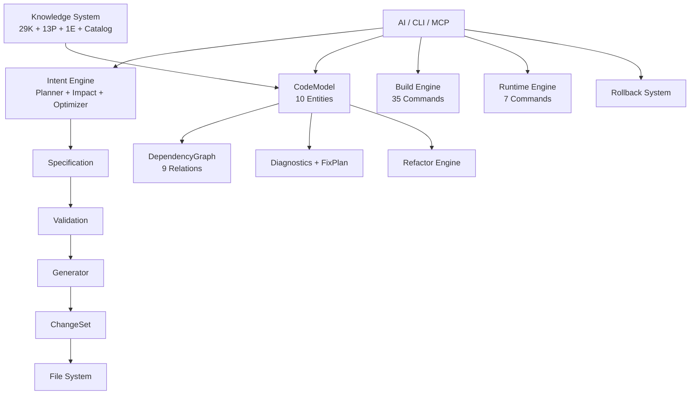

# CADE Wiki — CATIA CAA Development Engine v2.1.0

```
   ██████╗  █████╗ ██████╗ ███████╗
  ██╔════╝ ██╔══██╗██╔══██╗██╔════╝
  ██║      ███████║██║  ██║█████╗  
  ██║      ██╔══██║██║  ██║██╔══╝  
  ╚██████╗ ██║  ██║██████╔╝███████╗
   ╚═════╝ ╚═╝  ╚═╝╚═════╝ ╚══════╝
                                       
  CATIA CAA Development Engine
```

### 🎯 AI-Powered CATIA CAA Development. _One command. Eight files. Done._

---

## ⚡ 30-Second Start

```bash
git clone https://github.com/chenlei-gh/CADE.git
cp -r CADE/.agents /path/to/your/caa/project/
# Done. Zero config. CADE auto-detects CATIA.
```

🟢 **Zed** — works out of the box.  
🟡 **Claude / Cursor / VS Code / Windsurf** — run `python .agents/skills/catia-caa-dev/tools/setup_mcp.py`

---

## 🔥 Why CADE?

| ❌ Without CADE | ✅ With CADE |
| --- | --- |
| Manually create 8 files per command | `cade create command MyCmd MyModule --dialog` |
| Run RADE wizards, click through dialogs | Tell AI: "create a command with dialog" |
| `mkmk -u` then `mkCreateRuntimeView` then `CNEXT` | `cade build && cade run` |
| Guess what broke after refactoring | `cade diagnose && cade fix --apply` |
| No way to undo a mistaken delete | `cade rollback --id latest` |
| Wasting AI context on verbose output | Token optimizer saves 50% tokens automatically |
| Write CAA boilerplate by hand every time | 25+ templates, one call |

---

## 🧠 What's New in v2.1.0

### 📉 Token Optimizer
All MCP responses auto-optimized. Average **50% token savings**.

### 🧩 Intent Engine
Plan → Impact Analysis → Optimize. Complex tasks become structured workflows with alternative plans.

### 🎨 Advanced UI Layout (New!)
9 knowledge files covering every CAA UI scenario:
- **7 GridConstraints anchor types**, multi-layer nesting, stretch strategies
- **Master-Detail**: SelectorList + Properties panel
- **Dynamic Form**: Combo-driven panel show/hide
- **Tree Navigation**: CATDlgTree + tab content
- **Wizard**: State-machine Back/Next multi-step
- **Anti-Patterns**: 10 common mistakes → correct approach

### 📐 Three New Domains (New!)

| Domain | Knowledge | Pattern | Use Case |
|--------|-----------|---------|----------|
| **Drawing** | Views, annotations, BOM tables | Batch drawing generation | Auto-drawings |
| **Surface/GSD** | Extrude, sweep, flatten, join | Surface analysis automation | Surface flattening |
| **FTA / 3D PMI** | Capture, annotation, tolerance | Auto-annotation generation | 3D PMI |

---

## 🗺️ Command Reference

### 🏗 Create
```bash
cade create command MyCmd MyModule --dialog --wb MyWb
cade create feature  MyFeature MyModule
cade create extension MyExt CATPart MyModule
```
→ Generates .cpp, .h, Header, Catalog, NLS, Icon, Dictionary, Imakefile — **8 files, one call**.

### 🔨 Build & Run
```bash
cade build                          # incremental (mkmk -u)
cade build --full --threads 8       # full rebuild, 8 threads
cade run                            # start CATIA Runtime View
cade run --stop                     # stop CATIA
```

### 🔍 Analyze & Fix
```bash
cade analyze --graph                # Mermaid dependency diagram
cade diagnose                       # find issues
cade fix --apply                    # auto-fix broken references
cade validate                       # integrity check
```

### ♻️ Refactor & Rollback
```bash
cade refactor rename OldCmd NewCmd --module MyModule
cade snapshot                       # checkpoint
cade rollback --id latest           # undo anything
```

### 🤖 AI & Docs
```bash
cade suggest                        # AI recommends next action
cade docs                           # auto-generate documentation
cade test --quick                   # run 24 suites (~8s)
cade impact IMyInterface delete     # assess blast radius
```

> 🔌 Also available as **MCP Server** (41 tools) and **Python API** (~80 functions).

---

## 📖 Navigation

| 你想... | 看这个 |
| --- | --- |
| 🏗 **创建第一个命令** | [Getting Started](#getting-started) |
| 🔍 **分析工作区** | [Workspace Analysis](#workspace-analysis) |
| 🔧 **诊断和修复** | [Diagnostics & FixPlan](#diagnostics--fixplan) |
| ♻️ **重构代码** | [Safe Refactoring](#safe-refactoring) |
| 📦 **理解架构** | [Architecture](#architecture) |
| 🤖 **AI 如何调用 CADE** | [AI Integration Guide](#ai-integration-guide) |
| 📚 **查阅 API 参考** | [CAA API Reference](#caa-api-reference) |
| 🧩 **使用开发模式** | [Development Patterns](#development-patterns) |
| 📝 **查看真实示例** | [Real Examples](#real-examples) |
| 🔌 **配置 MCP Server** | [MCP Server Setup](#mcp-server) |
| 🧪 **运行测试** | [Test Suite](#test-suite) |
| 🆘 **遇到问题** | [Troubleshooting](#troubleshooting) |

---

## 🧠 Architecture



**Philosophy**: Capability grows by accumulating knowledge, not by modifying code.

| Layer | Module | What It Does |
| --- | --- | --- |
| **Intent** | `intents.py` | "Create command with dialog" → 8 file operations |
| **Action** | `actions.py` | Atomic: analyze, list, validate |
| **Spec** | `specification.py` | AI writes Spec → Generator consumes |
| **CodeModel** | `meta_model.py` | 10 domain entities, 9 relation types |
| **Generator** | `generator.py` | 25+ template types |
| **ChangeSet** | `changeset.py` | Atomic file writer, preview first |
| **Diagnostics** | `diagnostics.py` | Auto-detect issues, generate FixPlan |
| **Refactor** | `refactor.py` | Rename/move, auto-update all references |
| **Backup** | `backup.py` | Snapshot → rollback to any point |
| **TokenOpt** | `token_optimizer.py` | AI-friendly output (~50% token savings) |
| **Intent Engine** | `intent/` | Planner → Impact → Optimizer pipeline |

---

## ⚡ Three Rules (最高优先级)

| # | Rule | Meaning |
| --- | --- | --- |
| 1 | 🚫 **Don't Reinvent** | Use templates. Don't write CAA boilerplate manually. |
| 2 | 🚫 **Don't Guess** | Check docs first on unknown errors. Never speculate. |
| 3 | 🚫 **Don't Skip Help** | Search knowledge/patterns/examples/docs before coding. |

```
Unknown Error
    ↓
① Check docs/FAQ.md, docs/guides/   ← Help docs first
    ↓
② cade diagnose                     ← Let engine analyze
    ↓
③ Check knowledge/ (8 domains)      ← API reference
    ↓
④ Check patterns/ (12 patterns)     ← Architecture patterns
    ↓
⑤ Check examples/                   ← Real code examples
    ↓
⑥ cade fix --apply                  ← Auto-fix
```

---

## 📊 By the Numbers

| Metric | Value |
| --- | --- |
| Test Suites | **24** (L1-L7 + Integration + Audit) |
| Test Files | **27** (24 suites + 3 standalone) |
| Checks | **~600** |
| Pass Rate | **100%** (verified 2026-07-10) |
| CLI Commands | **22** |
| MCP Tools | **41** |
| Python APIs | **~80** |
| Build Commands | **35** |
| Templates | **25+** |
| Spec Types | **8** |
| Refactor Operations | **3** |
| Domain Entities | **10** |
| Knowledge Assets | **41** (29K + 13P + 1E) |
| Knowledge Domains | **8** (MecMod, Part, Product, UI, Drawing, Surface, FTA, Infra) |
| Frontmatter Coverage | **100%** |

---

## 📂 Project Structure

```
your_project/
├── .agents/skills/catia-caa-dev/   ← CADE (drop-in)
│   ├── SKILL.md                    ← Main skill doc (start here)
│   ├── skills/                     ← Engine (23 modules)
│   │   ├── intents/                ← Intent Layer (6 subs)
│   │   ├── intent/                 ← Intent Engine (Planner + Impact + Optimizer)
│   │   ├── actions.py              ← Action Layer
│   │   ├── specification.py        ← Spec Layer
│   │   ├── diagnostics.py          ← Diagnostics + FixPlan
│   │   ├── refactor.py             ← Safe Refactoring
│   │   ├── generator.py            ← Code Generator
│   │   ├── meta_model.py           ← Domain Model
│   │   ├── token_optimizer.py      ← AI Token Optimizer
│   │   └── ...
│   ├── templates/                  ← 25+ code templates
│   ├── knowledge/                  ← CAA API reference (8 domains)
│   │   ├── mecmod/                 ← Feature, topology
│   │   ├── part/                   ← Fillet, hole, chamfer
│   │   ├── product/                ← Assembly, constraints
│   │   ├── ui/                     ← Dialog, layout, patterns (9 files)
│   │   ├── drawing/                ← Views, annotations, BOM
│   │   ├── surface/                ← Extrude, sweep, flatten
│   │   ├── fta/                    ← 3D annotation, tolerance
│   │   └── infrastructure/         ← Selection, memory, naming
│   ├── patterns/                   ← Architecture patterns (12 patterns, 7 types)
│   ├── examples/                   ← Real CAA projects
│   ├── tests/                      ← 24 suites, 700+ cases
│   ├── docs/                       ← Full documentation
│   ├── tools/                      ← Setup, validation, utilities
│   └── config/                     ← Editor MCP templates
├── MyFramework.edu/
├── MyModule.m/
└── ...
```

---

## 🔗 Links

- 📖 [Main Documentation](https://github.com/chenlei-gh/CADE)
- 🏗 [Architecture Reference](https://github.com/chenlei-gh/CADE/blob/main/.agents/skills/catia-caa-dev/docs/references/ARCHITECTURE.md)
- 📝 [Changelog](https://github.com/chenlei-gh/CADE/blob/main/.agents/skills/catia-caa-dev/CHANGELOG.md)
- 📋 [SKILL.md](https://github.com/chenlei-gh/CADE/blob/main/.agents/skills/catia-caa-dev/SKILL.md)

---

**Made with ❤️ for CATIA CAA Developers**

_Questions? [Troubleshooting](https://github.com/chenlei-gh/CADE/blob/main/.agents/skills/catia-caa-dev/docs/guides/TROUBLESHOOTING_FLOWCHART.md) · Ideas? [Open an Issue](https://github.com/chenlei-gh/CADE/issues)_
