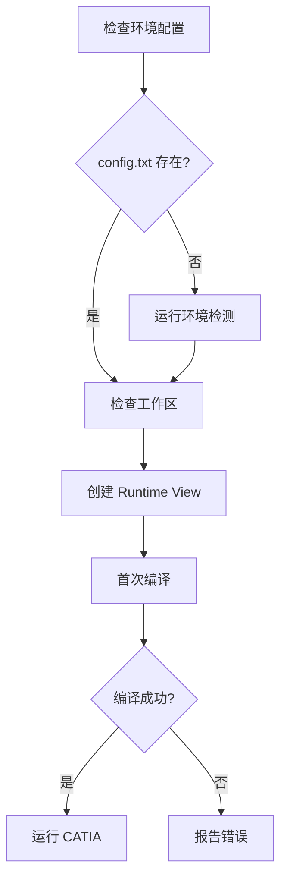
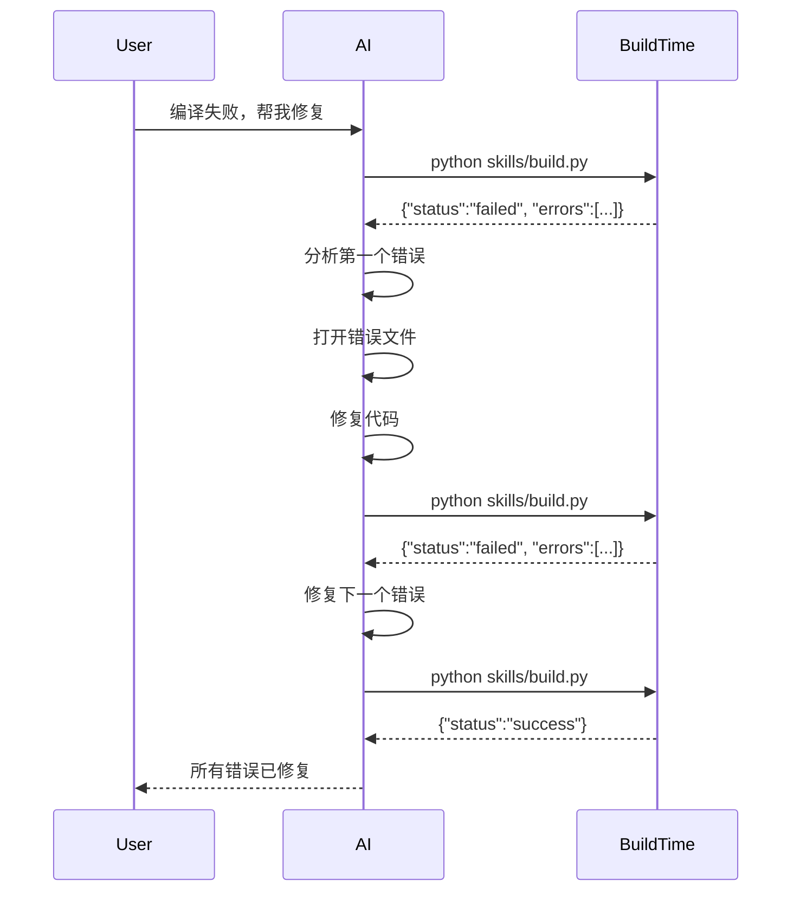
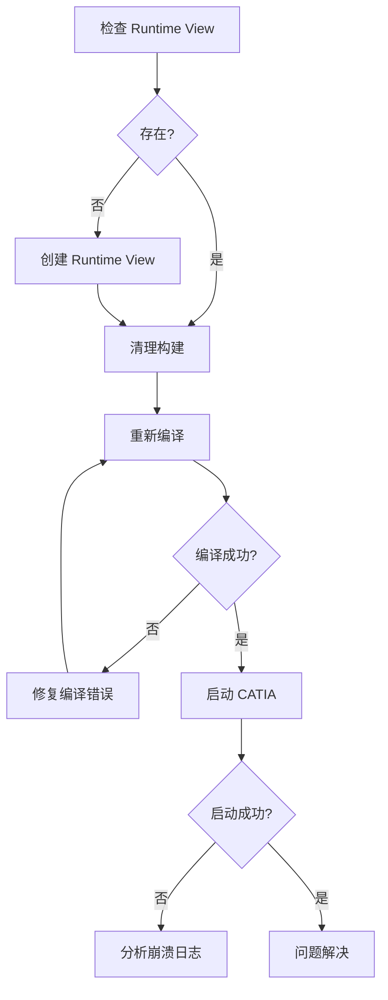

# AI 工作流实战示例

> **新版推荐**: 优先使用 Python API 直接调用，更简洁高效。
> 
> ```python
> from build import incremental_build, create_runtime_view
> from run import start_catia_runtime, stop_catia
> result = incremental_build(Path("D:/workspace"))
> ```
> 
> 本文档中的 `subprocess.run(["python", "skills/build.py"])` 方式依然可用，但推荐用上面的一行 API。

---

## 📋 目录

1. [场景 1：用户首次设置 CAA 项目](#场景-1用户首次设置-caa-项目)
2. [场景 2：修复编译错误](#场景-2修复编译错误)
3. [场景 3：创建新组件并测试](#场景-3创建新组件并测试)
4. [场景 4：调试崩溃问题](#场景-4调试崩溃问题)
5. [场景 5：批量编译多个 Framework](#场景-5批量编译多个-framework)
6. [场景 6：增量开发迭代](#场景-6增量开发迭代)

---

## 场景 1：用户首次设置 CAA 项目

### 用户请求
> "我刚下载了 CAA 项目，帮我设置并编译运行。"

### AI 决策流程



### AI 执行代码

```python
import subprocess
import json
from pathlib import Path

def setup_new_project(workspace_path):
    """首次设置 CAA 项目"""
    
    print("Step 1: 检查环境配置...")
    config_file = Path(".agents/skills/catia-caa-dev/caa_env_config.txt")
    
    if not config_file.exists():
        print("环境配置不存在，运行环境检测...")
        # 无需特殊环境
        subprocess.run([
            "initialize_caa_env.bat"
        ], cwd=".agents/skills/catia-caa-dev")
        print("✓ 环境配置完成")
    
    print("\nStep 2: 检查工作区结构...")
    # 无需特殊环境
    result = subprocess.run([
        "python", "skills/workspace.py", workspace_path
    ], capture_output=True, text=True, cwd=".agents/skills/catia-caa-dev")
    
    workspace_info = json.loads(result.stdout)
    
    if workspace_info["status"] != "ok":
        print(f"✗ 工作区验证失败:")
        for error in workspace_info["errors"]:
            print(f"  - {error}")
        return False
    
    print(f"✓ 工作区有效 ({workspace_info['frameworks']} frameworks)")
    
    print("\nStep 3: 创建 Runtime View...")
    # 使用 Build Time 环境（mkCreateRuntimeView 是 Build Time 工具）
    result = subprocess.run([
        "python", "skills/runtime_view.py", workspace_path, "--create"
    ], capture_output=True, text=True, cwd=".agents/skills/catia-caa-dev")
    
    runtime_info = json.loads(result.stdout)
    
    if runtime_info["status"] == "success":
        print(f"✓ Runtime View 已创建: {runtime_info['runtime']}")
    else:
        print(f"✗ Runtime View 创建失败: {runtime_info['message']}")
        return False
    
    print("\nStep 4: 首次编译...")
    # 使用 Build Time 环境
    result = subprocess.run([
        "python", "skills/build.py", workspace_path
    ], capture_output=True, text=True, cwd=".agents/skills/catia-caa-dev")
    
    build_info = json.loads(result.stdout)
    
    if build_info["status"] == "success":
        print(f"✓ 编译成功 (耗时: {build_info['duration']})")
        print(f"  - 错误: {build_info['error_count']}")
        print(f"  - 警告: {build_info['warning_count']}")
    else:
        print(f"✗ 编译失败 ({build_info['error_count']} 错误)")
        for error in build_info["errors"][:3]:  # 只显示前3个
            print(f"  - {error['file']}:{error['line']} - {error['message']}")
        return False
    
    print("\nStep 5: 启动 CATIA 测试...")
    # 使用 Run Time 环境
    result = subprocess.run([
        "python", "skills/run.py"
    ], capture_output=True, text=True, cwd=".agents/skills/catia-caa-dev")
    
    run_info = json.loads(result.stdout)
    
    if run_info["status"] == "started":
        print(f"✓ CATIA 已启动 (PID: {run_info['pid']})")
        print("\n项目设置完成！可以开始开发了。")
        return True
    else:
        print(f"✗ CATIA 启动失败: {run_info['message']}")
        return False

# 执行
setup_new_project("D:\\test\\TestFramework.edu")
```

### 环境使用总结

| 步骤 | 操作 | 环境 |
|-----|------|------|
| 1 | 环境检测 | 无 |
| 2 | 检查工作区 | 无 |
| 3 | 创建 Runtime View | **Build Time** |
| 4 | 编译 | **Build Time** |
| 5 | 运行 CATIA | **Run Time** |

---

## 场景 2：修复编译错误

### 用户请求
> "编译失败了，帮我修复错误。"

### AI 决策流程



### AI 执行代码

```python
def fix_compilation_errors(workspace_path, max_attempts=10):
    """迭代修复编译错误"""
    
    for attempt in range(1, max_attempts + 1):
        print(f"\n{'='*60}")
        print(f"尝试 {attempt}/{max_attempts}: 编译中...")
        print(f"{'='*60}")
        
        # 使用 Build Time 环境编译
        result = subprocess.run([
            "python", "skills/build.py", workspace_path
        ], capture_output=True, text=True, cwd=".agents/skills/catia-caa-dev")
        
        build_info = json.loads(result.stdout)
        
        if build_info["status"] == "success":
            print(f"\n✓ 编译成功！")
            print(f"  总共修复了 {attempt - 1} 个错误")
            print(f"  编译耗时: {build_info['duration']}")
            return True
        
        # 显示错误统计
        print(f"\n当前状态:")
        print(f"  - 错误数: {build_info['error_count']}")
        print(f"  - 警告数: {build_info['warning_count']}")
        
        if not build_info["errors"]:
            print("没有详细错误信息，无法自动修复")
            return False
        
        # 获取第一个错误
        first_error = build_info["errors"][0]
        print(f"\n正在修复错误 #{attempt}:")
        print(f"  文件: {first_error['file']}")
        print(f"  行号: {first_error['line']}")
        print(f"  错误码: {first_error['code']}")
        print(f"  信息: {first_error['message']}")
        
        # AI 在这里分析并修复代码
        # 例如：如果是缺少分号，就添加分号
        success = fix_error_in_file(
            first_error['file'],
            first_error['line'],
            first_error['code'],
            first_error['message']
        )
        
        if not success:
            print(f"✗ 无法自动修复此错误，需要人工干预")
            return False
        
        print(f"✓ 已修复，准备重新编译...")
    
    print(f"\n✗ 达到最大尝试次数 ({max_attempts})，仍有错误")
    return False

def fix_error_in_file(file_path, line, error_code, message):
    """根据错误类型修复代码"""
    
    # 示例：处理常见错误
    if error_code == "C2143" and "missing ';'" in message:
        # 缺少分号
        print(f"  → 检测到：缺少分号")
        # 读取文件，在指定行末尾添加分号
        # ... (实际代码修复逻辑)
        return True
    
    elif error_code == "C2065":
        # 未声明的标识符
        print(f"  → 检测到：未声明的标识符")
        # 添加必要的 #include 或变量声明
        # ... (实际代码修复逻辑)
        return True
    
    elif error_code == "C2039":
        # 不是成员
        print(f"  → 检测到：成员访问错误")
        # 检查类定义和成员拼写
        # ... (实际代码修复逻辑)
        return True
    
    else:
        # 未知错误类型
        print(f"  → 未知错误类型: {error_code}")
        return False

# 执行
fix_compilation_errors("D:\\test\\TestFramework.edu")
```

### 环境使用总结

- **全程只使用 Build Time**（因为都是编译操作）
- 每次修复后重新编译，直到成功
- 不涉及 Run Time 环境

---

## 场景 3：创建新组件并测试

### 用户请求
> "创建一个新的 Dialog 组件，名字叫 MySettingsDialog。"

### AI 执行代码

```python
def create_and_test_dialog(framework_path, dialog_name):
    """创建新 Dialog 组件并测试"""
    
    print("Step 1: 生成 Dialog 文件...")
    # 无需特殊环境（只是文件操作）
    files_created = generate_dialog_component(
        framework_path=framework_path,
        dialog_name=dialog_name,
        controls=["OK Button", "Cancel Button", "Text Editor"]
    )
    
    print(f"✓ 已创建 {len(files_created)} 个文件:")
    for file in files_created:
        print(f"  - {file}")
    
    print("\nStep 2: 验证工作区...")
    # 无需特殊环境
    result = subprocess.run([
        "python", "skills/workspace.py", framework_path
    ], capture_output=True, text=True, cwd=".agents/skills/catia-caa-dev")
    
    workspace_info = json.loads(result.stdout)
    
    if workspace_info["status"] != "ok":
        print("✗ 工作区验证失败")
        return False
    
    print("✓ 工作区结构正确")
    
    print("\nStep 3: 编译新组件...")
    # 使用 Build Time 环境
    result = subprocess.run([
        "python", "skills/build.py", framework_path
    ], capture_output=True, text=True, cwd=".agents/skills/catia-caa-dev")
    
    build_info = json.loads(result.stdout)
    
    if build_info["status"] != "success":
        print(f"✗ 编译失败 ({build_info['error_count']} 错误)")
        for error in build_info["errors"][:5]:
            print(f"  - {error['file']}:{error['line']} - {error['message']}")
        return False
    
    print(f"✓ 编译成功 ({build_info['duration']})")
    
    print("\nStep 4: 启动 CATIA 测试...")
    # 使用 Run Time 环境
    result = subprocess.run([
        "python", "skills/run.py"
    ], capture_output=True, text=True, cwd=".agents/skills/catia-caa-dev")
    
    run_info = json.loads(result.stdout)
    
    if run_info["status"] == "started":
        print(f"✓ CATIA 已启动 (PID: {run_info['pid']})")
        print(f"\n现在可以在 CATIA 中测试 {dialog_name} 了。")
        return True
    else:
        print(f"✗ CATIA 启动失败: {run_info['message']}")
        return False

def generate_dialog_component(framework_path, dialog_name, controls):
    """生成 Dialog 组件文件（模板）"""
    # 这里是文件生成逻辑
    # 返回创建的文件列表
    return [
        f"{framework_path}/LocalInterfaces/{dialog_name}.h",
        f"{framework_path}/src/{dialog_name}.cpp",
        f"{framework_path}/CNext/resources/msgcatalog/Framework.CATNls",
    ]

# 执行
create_and_test_dialog(
    "D:\\test\\TestFramework.edu",
    "MySettingsDialog"
)
```

### 环境使用总结

| 步骤 | 操作 | 环境 |
|-----|------|------|
| 1 | 生成文件 | 无 |
| 2 | 验证工作区 | 无 |
| 3 | 编译 | **Build Time** |
| 4 | 运行测试 | **Run Time** |

---

## 场景 4：调试崩溃问题

### 用户请求
> "CATIA 启动后立即崩溃，帮我找原因。"

### AI 决策流程



### AI 执行代码

```python
def debug_catia_crash(workspace_path):
    """调试 CATIA 崩溃问题"""
    
    print("诊断 1: 检查 Runtime View...")
    # 无需特殊环境
    result = subprocess.run([
        "python", "skills/runtime_view.py", workspace_path
    ], capture_output=True, text=True, cwd=".agents/skills/catia-caa-dev")
    
    runtime_info = json.loads(result.stdout)
    
    if runtime_info["status"] != "exists":
        print("✗ Runtime View 不存在或已损坏")
        print("  正在重新创建...")
        
        # 使用 Build Time 工具创建 Runtime View
        result = subprocess.run([
            "python", "skills/runtime_view.py", workspace_path, 
            "--create", "--overwrite"
        ], capture_output=True, text=True, cwd=".agents/skills/catia-caa-dev")
        
        print("✓ Runtime View 已重新创建")
    else:
        print("✓ Runtime View 存在")
    
    print("\n诊断 2: 清理旧构建...")
    # 无需特殊环境（直接删除）
    result = subprocess.run([
        "python", "skills/clean.py", workspace_path
    ], capture_output=True, text=True, cwd=".agents/skills/catia-caa-dev")
    
    clean_info = json.loads(result.stdout)
    print(f"✓ 已清理 {clean_info['objects_deleted']} 个 Objects 目录")
    
    print("\n诊断 3: 重新编译（Debug 模式）...")
    # 使用 Build Time 环境
    result = subprocess.run([
        "python", "skills/build.py", workspace_path, "-g"  # -g = debug
    ], capture_output=True, text=True, cwd=".agents/skills/catia-caa-dev")
    
    build_info = json.loads(result.stdout)
    
    if build_info["status"] != "success":
        print(f"✗ 编译失败，必须先修复错误:")
        for error in build_info["errors"][:5]:
            print(f"  - {error['file']}:{error['line']}")
        return False
    
    print(f"✓ 编译成功 ({build_info['duration']})")
    
    print("\n诊断 4: 尝试启动 CATIA...")
    # 使用 Run Time 环境
    result = subprocess.run([
        "python", "skills/run.py", "--wait", "--timeout", "60"
    ], capture_output=True, text=True, cwd=".agents/skills/catia-caa-dev")
    
    run_info = json.loads(result.stdout)
    
    if run_info["status"] == "crashed":
        print(f"✗ CATIA 仍然崩溃")
        print(f"  退出码: {run_info['exit_code']}")
        
        # 分析常见崩溃原因
        analyze_crash_code(run_info['exit_code'])
        return False
    
    elif run_info["status"] == "started":
        print("✓ CATIA 启动成功！")
        print("  崩溃问题已解决。")
        return True
    
    else:
        print(f"? 未知状态: {run_info['status']}")
        return False

def analyze_crash_code(exit_code):
    """分析崩溃退出码"""
    
    crash_codes = {
        -1073741819: "访问冲突 (0xC0000005) - 可能是空指针或内存越界",
        -1073741515: "缺少 DLL (0xC0000135) - Runtime View 可能不完整",
        -1073740791: "堆栈溢出 (0xC00000FD) - 可能是无限递归",
    }
    
    if exit_code in crash_codes:
        print(f"\n可能原因: {crash_codes[exit_code]}")
        print("建议:")
        print("  1. 检查最近修改的代码")
        print("  2. 验证指针使用")
        print("  3. 重新创建 Runtime View")
    else:
        print(f"\n未知崩溃码: {exit_code}")

# 执行
debug_catia_crash("D:\\test\\TestFramework.edu")
```

### 环境使用总结

| 诊断步骤 | 操作 | 环境 |
|---------|------|------|
| 1 | 检查/创建 Runtime View | **Build Time** |
| 2 | 清理构建 | 无 |
| 3 | 重新编译 | **Build Time** |
| 4 | 启动测试 | **Run Time** |

---

## 场景 5：批量编译多个 Framework

### 用户请求
> "我有 3 个 Framework，全部编译一遍。"

### AI 执行代码

```python
def batch_build_frameworks(framework_paths):
    """批量编译多个 Framework"""
    
    results = []
    
    for i, fw_path in enumerate(framework_paths, 1):
        fw_name = Path(fw_path).name
        print(f"\n{'='*60}")
        print(f"编译 Framework {i}/{len(framework_paths)}: {fw_name}")
        print(f"{'='*60}")
        
        # 使用 Build Time 环境编译
        result = subprocess.run([
            "python", "skills/build.py", fw_path, "--timeout", "1200"
        ], capture_output=True, text=True, cwd=".agents/skills/catia-caa-dev")
        
        build_info = json.loads(result.stdout)
        
        results.append({
            "framework": fw_name,
            "status": build_info["status"],
            "duration": build_info.get("duration", "N/A"),
            "errors": build_info.get("error_count", 0),
            "warnings": build_info.get("warning_count", 0)
        })
        
        if build_info["status"] == "success":
            print(f"✓ {fw_name}: 成功 ({build_info['duration']})")
        else:
            print(f"✗ {fw_name}: 失败 ({build_info['error_count']} 错误)")
    
    # 汇总报告
    print(f"\n{'='*60}")
    print("编译汇总")
    print(f"{'='*60}")
    
    success_count = sum(1 for r in results if r["status"] == "success")
    failed_count = len(results) - success_count
    
    print(f"总计: {len(results)} 个 Framework")
    print(f"成功: {success_count}")
    print(f"失败: {failed_count}")
    
    print("\n详细结果:")
    for r in results:
        status_icon = "✓" if r["status"] == "success" else "✗"
        print(f"  {status_icon} {r['framework']}: {r['duration']} "
              f"({r['errors']} 错误, {r['warnings']} 警告)")
    
    return success_count == len(results)

# 执行
batch_build_frameworks([
    "D:\\workspace\\FrameworkA.edu",
    "D:\\workspace\\FrameworkB.edu",
    "D:\\workspace\\FrameworkC.edu"
])
```

### 环境使用总结

- **全程只使用 Build Time**（都是编译操作）
- 每个 Framework 独立编译
- 可以并行执行（如果需要）

---

## 场景 6：增量开发迭代

### 用户请求
> "我在不断修改代码，每次改完都要编译测试。"

### AI 执行代码

```python
def incremental_development_loop(workspace_path):
    """增量开发迭代循环"""
    
    print("进入增量开发模式")
    print("每次代码修改后自动编译和测试\n")
    
    iteration = 0
    
    while True:
        iteration += 1
        print(f"\n{'='*60}")
        print(f"迭代 #{iteration}")
        print(f"{'='*60}")
        
        # 等待用户修改代码
        input("按 Enter 开始编译（或 Ctrl+C 退出）...")
        
        # 使用 Build Time 环境编译
        print("\n[Build Time] 编译中...")
        result = subprocess.run([
            "python", "skills/build.py", workspace_path
        ], capture_output=True, text=True, cwd=".agents/skills/catia-caa-dev")
        
        build_info = json.loads(result.stdout)
        
        if build_info["status"] == "success":
            print(f"✓ 编译成功 ({build_info['duration']})")
            
            # 询问是否运行
            run_test = input("\n是否启动 CATIA 测试? (y/n): ")
            
            if run_test.lower() == 'y':
                # 检查 CATIA 是否已运行
                result = subprocess.run([
                    "python", "skills/run.py", "--check"
                ], capture_output=True, text=True, cwd=".agents/skills/catia-caa-dev")
                
                check_info = json.loads(result.stdout)
                
                if check_info["status"] == "running":
                    print(f"ℹ CATIA 已在运行 (PID: {check_info['processes'][0]['pid']})")
                    print("  请在 CATIA 中重新加载组件")
                else:
                    # 使用 Run Time 环境启动
                    print("\n[Run Time] 启动 CATIA...")
                    result = subprocess.run([
                        "python", "skills/run.py"
                    ], capture_output=True, text=True, cwd=".agents/skills/catia-caa-dev")
                    
                    run_info = json.loads(result.stdout)
                    
                    if run_info["status"] == "started":
                        print(f"✓ CATIA 已启动 (PID: {run_info['pid']})")
        else:
            print(f"✗ 编译失败 ({build_info['error_count']} 错误)")
            
            # 显示前 3 个错误
            for error in build_info["errors"][:3]:
                print(f"  - {error['file']}:{error['line']}")
                print(f"    {error['message']}")
            
            # 询问是否自动修复
            auto_fix = input("\n尝试自动修复错误? (y/n): ")
            
            if auto_fix.lower() == 'y':
                # 调用错误修复函数
                fix_compilation_errors(workspace_path, max_attempts=3)

# 执行
try:
    incremental_development_loop("D:\\test\\TestFramework.edu")
except KeyboardInterrupt:
    print("\n\n退出增量开发模式")
```

### 环境使用总结

- **编译阶段：Build Time**（每次迭代）
- **运行阶段：Run Time**（按需）
- **检查阶段：Run Time**（检查是否已运行）

---

## 总结：所有场景的环境使用模式

| 场景 | Build Time 使用 | Run Time 使用 | 无环境使用 |
|-----|----------------|--------------|-----------|
| 首次设置 | 创建 Runtime View, 编译 | 启动 CATIA | 环境检测, 工作区验证 |
| 修复错误 | 多次编译 | 不使用 | - |
| 创建组件 | 编译新代码 | 测试组件 | 生成文件, 验证结构 |
| 调试崩溃 | 重建 Runtime View, 重新编译 | 测试启动 | 清理构建 |
| 批量编译 | 编译所有 Framework | 不使用 | - |
| 增量迭代 | 每次编译 | 按需启动 | 检查状态 |

### 关键规律

1. **编译永远用 Build Time**
2. **运行永远用 Run Time**
3. **检查/清理通常不需要环境**
4. **创建 Runtime View 用 Build Time**（特殊情况）

---

**版本：** 1.0.0  
**最后更新：** 2026-07-06  
**适用场景：** 所有 CAA 开发工作流
