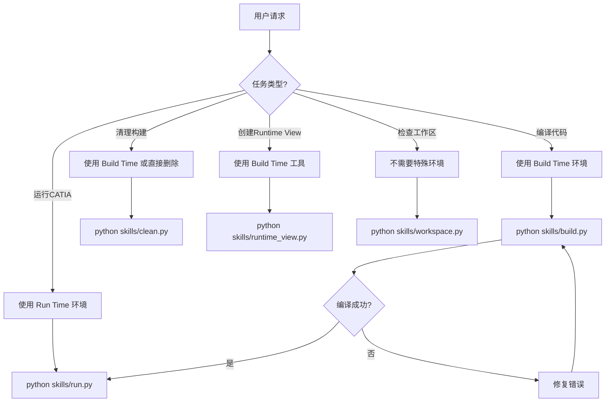
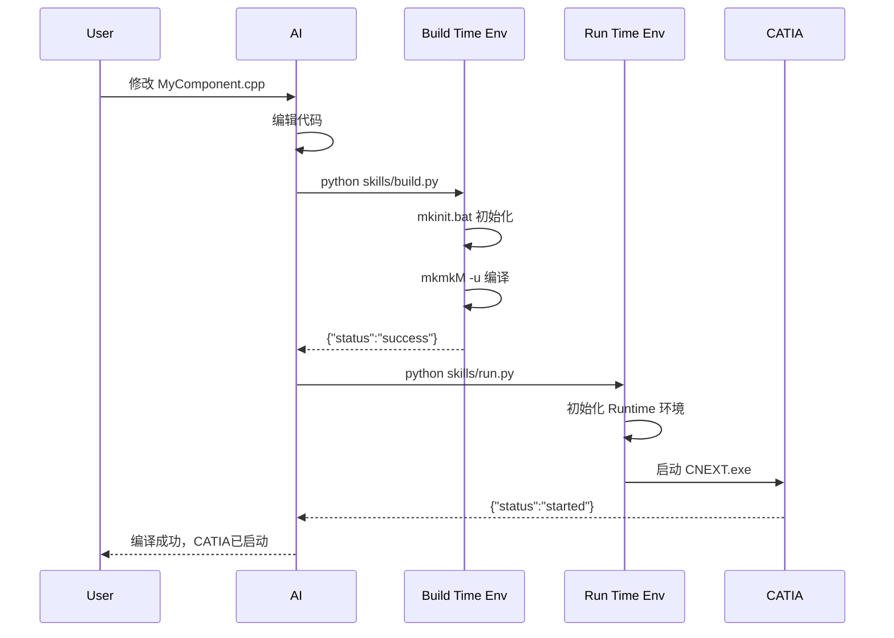

# Build Time vs Run Time 环境使用指南

## 📋 目录

1. [概述](#概述)
2. [Build Time 环境](#build-time-环境)
3. [Run Time 环境](#run-time-环境)
4. [决策树：何时使用哪个环境](#决策树何时使用哪个环境)
5. [完整工作流示例](#完整工作流示例)
6. [常见场景和最佳实践](#常见场景和最佳实践)
7. [故障排除](#故障排除)

---

## 概述

CATIA CAA 开发中有两个独立的环境，每个环境有不同的用途和初始化方式：

| 环境 | 用途 | 初始化方式 | 主要工具 | Skill 调用 |
|------|------|-----------|---------|-----------|
| **Build Time** | 编译 CAA 代码 | `mkinit.bat` | `mkmkM.exe`, `cl.exe`, `link.exe` | `build.py`, `clean.py` |
| **Run Time** | 运行 CATIA | `mkrun.bat` | `CNEXT.exe`, Runtime View | `run.py`, `runtime_view.py` |

**核心原则：**
- ✅ 编译时使用 Build Time
- ✅ 运行时使用 Run Time
- ❌ 不要混用

---

## Build Time 环境

### 🎯 目的

Build Time 环境用于 **编译 CAA 代码**，它需要：

1. Visual Studio 编译器 (`cl.exe`)
2. Windows SDK 链接器 (`link.exe`)
3. CATIA 构建工具 (`mkmkM.exe`)
4. 相关环境变量 (PATH, INCLUDE, LIB)

### 🔧 初始化方式

```batch
# Build Time Prompt 调用链 (B28)
cmd.exe
  → mkinit.bat                  # 检测 VS2012, Windows Kit
  → 设置 PATH, INCLUDE, LIB
  → 现在可以运行 mkmkM.exe
```

**在 Python 中调用：**

```python
from env import CAAEnvironment

caa_env = CAAEnvironment()
cmd, cmd_display = caa_env.build_time_command(workspace_path, "-u")

# cmd = ["cmd", "/c", "call mkinit.bat && cd workspace && mkmkM -u"]
subprocess.run(cmd, ...)
```

### 📂 使用 Build Time 的 Skills

#### 1. **build.py** (主要使用者)

**使用场景：**
- 编译整个 workspace
- 编译单个 framework
- 编译单个 module

**调用方式：**
```bash
python skills/build.py D:\test\TestFramework.edu
```

**内部实现：**
```python
# build.py 内部流程
caa_env = CAAEnvironment()
cmd, cmd_display = caa_env.build_time_command(workspace_path, options)
# cmd = ["cmd", "/c", "call mkinit.bat && mkmkM -u"]

subprocess.run(cmd, timeout=600)
```

**关键点：**
- ✅ 每次编译都必须初始化 Build Time 环境
- ✅ 使用 `mkinit.bat` 而不是 `tck_init.bat`
- ✅ 必须在 cmd.exe 中调用（环境变量只在该 shell 有效）

---

#### 2. **clean.py** (次要使用者)

**使用场景：**
- 清理 Objects 目录

**调用方式：**
```bash
python skills/clean.py D:\test\TestFramework.edu
```

**内部实现：**
```python
# clean.py 可以选择两种方式
# 方式 1: 直接删除 Objects 目录 (不需要 Build Time)
shutil.rmtree(objects_dir)

# 方式 2: 使用 mkmk -u (需要 Build Time)
caa_env = CAAEnvironment()
cmd, _ = caa_env.build_time_command(workspace_path, "-u")
subprocess.run(cmd)
```

**推荐：**
- 简单清理：直接删除 Objects 目录（不需要 Build Time）
- 完整清理：使用 `mkmk -u`（需要 Build Time）

---

### ⚠️ Build Time 常见错误

| 错误 | 原因 | 解决方案 |
|------|------|---------|
| `'mkmkM' is not recognized` | PATH 未设置 | 必须通过 `mkinit.bat` 初始化 |
| `0xC0000142` (DLL_INIT_FAILED) | 直接运行 mkmkM.exe | 必须在 cmd.exe 中通过 `mkinit.bat` 初始化 |
| `Cannot find Visual Studio` | mkinit.bat 未检测到 VS | 检查 VS2012 是否安装 |
| `error C2143: missing ';'` | 代码语法错误 | 修复代码后重新编译 |

---

## Run Time 环境

### 🎯 目的

Run Time 环境用于 **运行 CATIA**，它需要：

1. CATIA 运行时库 (DLLs)
2. Runtime View (包含你的 CAA 组件)
3. 许可证配置
4. 相关环境变量 (CATInstallPath, CATDLLPath)

### 🔧 初始化方式

```batch
# Run Time Prompt 调用链 (B28)
cmd.exe
  → mkrun.bat                    # 设置 Runtime 环境变量
  → 设置 CATInstallPath, CATDLLPath
  → 现在可以运行 CNEXT.exe
```

**在 Python 中调用：**

```python
from env import CAAEnvironment

caa_env = CAAEnvironment()
env_vars = caa_env.initialize()  # 设置基本 Runtime 变量

cnext_path = caa_env.get_cnext_path()
subprocess.Popen([str(cnext_path)], env=env_vars)
```

### 📂 使用 Run Time 的 Skills

#### 1. **run.py** (主要使用者)

**使用场景：**
- 启动 CATIA 测试 CAA 组件
- 检查 CATIA 是否正在运行
- 等待 CATIA 退出

**调用方式：**
```bash
python skills/run.py                # 启动 CATIA (后台)
python skills/run.py --wait         # 启动并等待退出
python skills/run.py --check        # 检查是否运行
```

**内部实现：**
```python
# run.py 内部流程
caa_env = CAAEnvironment()
env_vars = caa_env.initialize()  # 设置 Runtime 环境

cnext_path = caa_env.get_cnext_path()
process = subprocess.Popen([str(cnext_path)], env=env_vars)
```

**关键点：**
- ✅ 启动前检查 CATIA 是否已运行（避免多实例冲突）
- ✅ 可以后台启动或前台等待
- ✅ 需要有效的 Runtime View

---

#### 2. **runtime_view.py** (辅助工具)

**使用场景：**
- 创建 Runtime View
- 检查 Runtime View 是否存在

**调用方式：**
```bash
python skills/runtime_view.py --create    # 创建 Runtime View
python skills/runtime_view.py             # 检查 Runtime View
```

**内部实现：**
```python
# runtime_view.py 使用 Build Time 工具创建 Runtime View
# 注意：mkCreateRuntimeView 是 Build Time 工具
caa_env = CAAEnvironment()
cmd, _ = caa_env.build_time_command(workspace_path, "")
# 修改命令为 mkCreateRuntimeView

subprocess.run(cmd)
```

**特殊说明：**
- `mkCreateRuntimeView` 虽然创建的是 Runtime View，但它本身是 Build Time 工具
- 所以 `runtime_view.py` 需要 Build Time 环境来创建 Runtime View

---

### ⚠️ Run Time 常见错误

| 错误 | 原因 | 解决方案 |
|------|------|---------|
| `CNEXT.exe not found` | CATIA 路径错误 | 检查 `caa_env_config.txt` |
| `No licenses available` | 许可证未配置 | 配置 CATIA 许可证服务器 |
| `Runtime View not found` | 未创建 Runtime View | 运行 `python skills/runtime_view.py --create` |
| `CATIA is already running` | CATIA 已在运行 | 使用 `--check` 检查状态 |

---

## 决策树：何时使用哪个环境



### 快速参考表

| 用户请求 | 使用的 Skill | 需要的环境 | 命令 |
|---------|------------|-----------|------|
| "编译我的代码" | `build.py` | Build Time | `python skills/build.py` |
| "清理构建" | `clean.py` | Build Time (可选) | `python skills/clean.py` |
| "运行CATIA" | `run.py` | Run Time | `python skills/run.py` |
| "创建Runtime View" | `runtime_view.py` | Build Time | `python skills/runtime_view.py --create` |
| "检查工作区" | `workspace.py` | 无 | `python skills/workspace.py` |
| "检查CATIA是否运行" | `run.py` | Run Time | `python skills/run.py --check` |

---

## 完整工作流示例

### 示例 1：标准开发周期（修改代码 → 编译 → 测试）



**代码示例：**

```python
# AI 的完整流程
# Step 1: 修改代码
edit_file("TestFramework.edu/TestModule.m/src/MyComponent.cpp", changes)

# Step 2: 编译 (使用 Build Time)
result = subprocess.run(["python", "skills/build.py", "TestFramework.edu"], 
                       capture_output=True, text=True)
build_result = json.loads(result.stdout)

if build_result["status"] == "success":
    # Step 3: 运行 (使用 Run Time)
    result = subprocess.run(["python", "skills/run.py"], 
                           capture_output=True, text=True)
    run_result = json.loads(result.stdout)
    print(f"CATIA started: {run_result['message']}")
else:
    # Step 4: 修复错误
    for error in build_result["errors"]:
        print(f"Error in {error['file']} line {error['line']}: {error['message']}")
```

---

### 示例 2：首次设置工作区

```mermaid
graph LR
    A[用户: 设置新工作区] --> B[检查环境配置]
    B --> C{config存在?}
    C -->|否| D[运行 initialize_caa_env.bat]
    C -->|是| E[检查工作区结构]
    D --> E
    E --> F[python skills/workspace.py]
    F --> G{工作区有效?}
    G -->|否| H[报告错误]
    G -->|是| I[创建 Runtime View]
    I --> J[python skills/runtime_view.py --create]
    J --> K[Build Time: mkCreateRuntimeView]
    K --> L[首次编译]
    L --> M[python skills/build.py]
    M --> N[Build Time: mkmkM]
    N --> O{编译成功?}
    O -->|是| P[测试运行]
    O -->|否| Q[修复错误]
    P --> R[python skills/run.py]
    R --> S[Run Time: CNEXT]
```



**代码示例：**

```python
# Step 1: 检查环境
if not Path("caa_env_config.txt").exists():
    subprocess.run(["initialize_caa_env.bat"])

# Step 2: 检查工作区
result = subprocess.run(["python", "skills/workspace.py", workspace_path])
workspace_info = json.loads(result.stdout)

if workspace_info["status"] != "ok":
    print("Workspace errors:", workspace_info["errors"])
    exit(1)

# Step 3: 创建 Runtime View (使用 Build Time 工具)
result = subprocess.run(["python", "skills/runtime_view.py", workspace_path, "--create"])
runtime_info = json.loads(result.stdout)

if runtime_info["status"] == "success":
    # Step 4: 编译 (使用 Build Time)
    result = subprocess.run(["python", "skills/build.py", workspace_path])
    build_info = json.loads(result.stdout)
    
    if build_info["status"] == "success":
        # Step 5: 运行 (使用 Run Time)
        subprocess.run(["python", "skills/run.py"])
```

---

### 示例 3：快速迭代（多次编译）

```python
# 快速迭代场景：修复多个编译错误
workspace = "TestFramework.edu"
max_attempts = 5

for attempt in range(max_attempts):
    print(f"\n=== Attempt {attempt + 1} ===")
    
    # 编译 (Build Time)
    result = subprocess.run(
        ["python", "skills/build.py", workspace],
        capture_output=True, text=True
    )
    build_result = json.loads(result.stdout)
    
    if build_result["status"] == "success":
        print("✓ Build successful!")
        
        # 运行测试 (Run Time)
        subprocess.run(["python", "skills/run.py"])
        break
    else:
        print(f"✗ Build failed with {build_result['error_count']} errors")
        
        # 修复第一个错误
        first_error = build_result["errors"][0]
        print(f"Fixing: {first_error['file']} line {first_error['line']}")
        
        # AI 修复代码...
        fix_error(first_error)
        
        # 继续下一次尝试
        continue
else:
    print("Failed after maximum attempts")
```

---

## 常见场景和最佳实践

### ✅ 正确的做法

#### 场景 1：编译前检查工作区

```python
# 正确：先检查，再编译
subprocess.run(["python", "skills/workspace.py", workspace])  # 无需特殊环境
subprocess.run(["python", "skills/build.py", workspace])      # Build Time
```

#### 场景 2：编译成功后运行

```python
# 正确：分离 Build Time 和 Run Time
result = subprocess.run(["python", "skills/build.py"], capture_output=True)
build_info = json.loads(result.stdout)

if build_info["status"] == "success":
    subprocess.run(["python", "skills/run.py"])  # 完全独立的 Run Time 环境
```

#### 场景 3：检查 CATIA 是否运行再启动

```python
# 正确：避免多实例
result = subprocess.run(["python", "skills/run.py", "--check"], capture_output=True)
check_result = json.loads(result.stdout)

if check_result["status"] == "not_running":
    subprocess.run(["python", "skills/run.py"])
else:
    print(f"CATIA already running (PID: {check_result['processes'][0]['pid']})")
```

---

### ❌ 错误的做法

#### 错误 1：尝试在同一个进程中混用环境

```python
# ❌ 错误：环境变量会冲突
env = {}
env.update(build_time_env)  # Build Time 变量
env.update(run_time_env)    # Run Time 变量 (会覆盖)

subprocess.run(["mkmkM"], env=env)  # 可能失败
```

**原因：** Build Time 和 Run Time 的 PATH、DLL 路径可能冲突。

**正确做法：** 每个任务使用独立的环境。

---

#### 错误 2：直接运行 mkmkM.exe 不初始化环境

```python
# ❌ 错误：会报 0xC0000142 错误
subprocess.run(["C:\\...\\mkmkM.exe", "-u"])
```

**原因：** mkmkM.exe 依赖 Build Time 环境变量。

**正确做法：** 使用 `env.build_time_command()` 通过 mkinit.bat 初始化。

---

#### 错误 3：假设编译成功就运行

```python
# ❌ 错误：没有检查 Runtime View
subprocess.run(["python", "skills/build.py"])
subprocess.run(["python", "skills/run.py"])  # 可能失败：Runtime View 不存在
```

**原因：** 即使编译成功，没有 Runtime View 就无法运行。

**正确做法：** 先检查/创建 Runtime View。

```python
# ✅ 正确
subprocess.run(["python", "skills/runtime_view.py", "--create"])
subprocess.run(["python", "skills/build.py"])
subprocess.run(["python", "skills/run.py"])
```

---

## 故障排除

### 问题 1：Build Time 初始化失败

**症状：**
```
ERROR: mkinit.bat not found
```

**检查：**
```python
python skills/env.py
# 查看输出中的 mkinit_bat 路径
```

**解决方案：**
1. 检查 `caa_env_config.txt` 中的 `CATIA_INSTALL` 路径
2. 确认 `<CATIA>\win_b64\code\command\mkinit.bat` 存在
3. 重新运行 `initialize_caa_env.bat`

---

### 问题 2：编译时找不到 Visual Studio

**症状：**
```
Cannot find Visual Studio 2012
```

**原因：** `mkinit.bat` 无法检测到 VS2012。

**解决方案：**
1. 确认 VS2012 已安装
2. 检查注册表键值（mkinit.bat 通过注册表查找 VS）
3. 手动设置环境变量后再编译

---

### 问题 3：Runtime 启动失败

**症状：**
```json
{
  "status": "crashed",
  "exit_code": -1073741819
}
```

**原因：**
- 缺少 Runtime View
- 缺少许可证
- DLL 依赖问题

**解决方案：**

```python
# Step 1: 检查 Runtime View
subprocess.run(["python", "skills/runtime_view.py"])

# Step 2: 创建 Runtime View (如果不存在)
subprocess.run(["python", "skills/runtime_view.py", "--create"])

# Step 3: 重新编译
subprocess.run(["python", "skills/build.py"])

# Step 4: 再次运行
subprocess.run(["python", "skills/run.py"])
```

---

### 问题 4：CATIA 多实例冲突

**症状：**
```json
{
  "status": "already_running",
  "pid": 12345
}
```

**解决方案：**

```python
# 方案 1: 检查后再启动
result = subprocess.run(["python", "skills/run.py", "--check"], capture_output=True)
check = json.loads(result.stdout)

if check["status"] == "running":
    print("关闭现有 CATIA 实例后再启动")
else:
    subprocess.run(["python", "skills/run.py"])

# 方案 2: 强制使用现有实例
if check["status"] == "running":
    print(f"使用现有 CATIA 实例 (PID: {check['processes'][0]['pid']})")
```

---

## 总结

### 核心要点

1. **Build Time = 编译工具**
   - 使用 `mkinit.bat` 初始化
   - 运行 `mkmkM.exe` 编译
   - 依赖 VS2012 编译器
   - 由 `build.py` 和 `runtime_view.py` 使用

2. **Run Time = 运行环境**
   - 使用 `mkrun.bat` 初始化（或直接设置环境变量）
   - 运行 `CNEXT.exe`
   - 依赖 Runtime View
   - 由 `run.py` 使用

3. **环境隔离**
   - 每个任务使用独立环境
   - 不要在同一个进程中混用
   - 通过 `env.py` 统一管理

4. **标准流程**
   ```
   workspace.py (检查) 
     → runtime_view.py --create (创建Runtime View, Build Time)
     → build.py (编译, Build Time) 
     → run.py (运行, Run Time)
   ```

---

**版本：** 1.0.0  
**最后更新：** 2026-07-06  
**适用于：** CATIA V5 R28 (B28)
