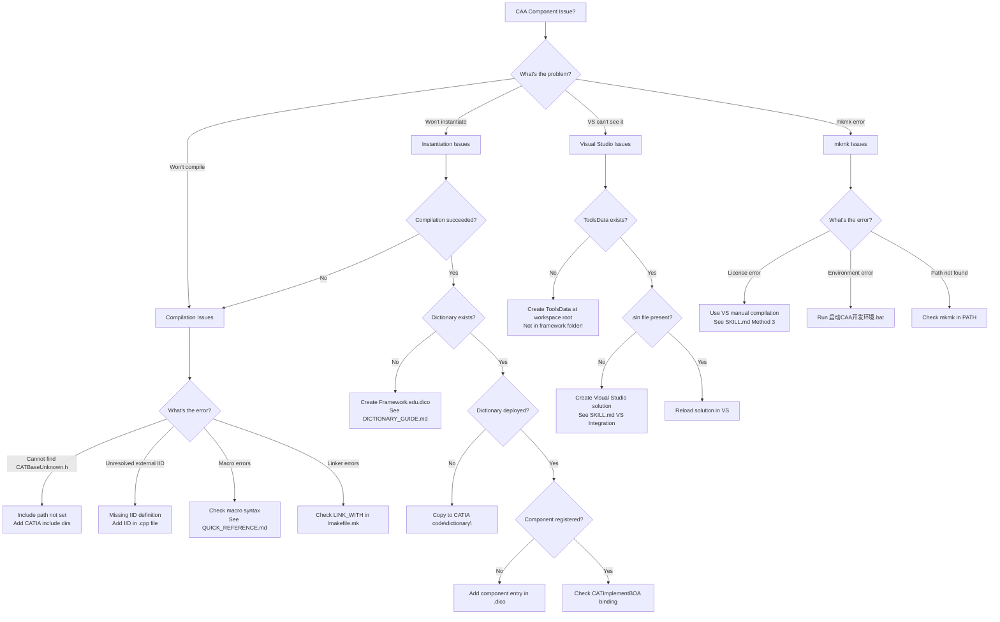

# CAA Component Troubleshooting Flowchart

Quick visual guide to diagnose and fix common CAA development issues.

---

## 🚀 Quick Start Decision Tree



---

## 🔍 Error Code Quick Reference

| Error Type | Quick Fix | Details |
|------------|-----------|---------|
| **E0001** | Cannot open source file "CATBaseUnknown.h" | → Add CATIA include paths to VS |
| **E0002** | 'CATDeclareClass' undeclared identifier | → Missing macro include |
| **E0003** | unresolved external symbol IID_IInterface | → Add IID in interface .cpp |
| **E0004** | Component instantiation returns E_FAIL | → Check Dictionary file |
| **E0005** | mkmk license error (MAB product) | → Use VS manual compilation |
| **E0006** | VS Workspace Explorer doesn't show framework | → Check ToolsData location |
| **E0007** | fatal error C1083: TIE_*.h not found | → Use CATImplementBOA instead (B28 uses BOA pattern) |
| **E0008** | LNK2019: MetaObject unresolved | → Create IInterface.cpp with CATImplementInterface |

---

## 📋 Compilation Checklist

Use this when code won't compile:

```
Phase 1: File Structure
□ IdentityCard.h exists in Framework.edu/IdentityCard/
□ Interface.h exists in Framework.edu/PublicInterfaces/
□ Module.m/ directory exists
□ Imakefile.mk exists in Module.m/
□ Component.h exists in Module.m/LocalInterfaces/
□ IInterface.cpp exists in Module.m/src/
□ Component.cpp exists in Module.m/src/
□ Framework.edu.dico exists in CNext/code/dictionary/

Phase 2: IdentityCard.h
□ No #ifndef guard (critical!)
□ Has AddPrereqComponent() macros
□ Has COPYRIGHT header

Phase 3: Interface.h
□ Has #ifndef guard (lowercase _h)
□ Has CATDeclareInterface macro
□ Has IID extern declaration
□ Has ExportedByModuleName macro
□ All methods are pure virtual (= 0)

Phase 4: Component.h
□ Has #ifndef guard (uppercase _H)
□ Has CATDeclareClass macro
□ Includes interface header
□ Declares interface methods (not pure virtual)

Phase 5: Interface.cpp (NEW — required for linking!)
□ Includes interface header
□ Defines IID with GUID values
□ Has CATImplementInterface(Interface, CATBaseUnknown)

Phase 6: Component.cpp
□ Has CATImplementClass macro
□ Has CATImplementBOA macro
□ IID is NOT defined here (moved to IInterface.cpp)
□ Has constructor and destructor
□ Implements all interface methods
□ Uses cout not std::cout
□ Uses "iostream.h" not <iostream>

Phase 6: Imakefile.mk
□ Has BUILT_OBJECT_TYPE = SHARED LIBRARY
□ Has LINK_WITH= (NO space before =)
□ Lists required libraries

Phase 7: Dictionary
□ Framework.edu.dico exists
□ Has component registration line
□ Has CATICreateInstance entry
□ Has interface entry
□ Uses lib prefix (e.g., libModuleName)
```

---

## ⚡ Fast Fixes (< 1 minute)

### Fix 1: Missing IID Definition
**Symptom**: `unresolved external symbol IID_IMyInterface`

**Solution**: Add to Component.cpp (after CATImplementBOA macro):
```cpp
IID IID_IMyInterface = { 
    0x12345678, 0x1234, 0x1234,
    { 0x12, 0x34, 0x56, 0x78, 0x9A, 0xBC, 0xDE, 0xF0 } 
};
```

### Fix 2: IdentityCard Header Guard
**Symptom**: Compilation error in IdentityCard.h

**Solution**: Remove all `#ifndef`, `#define`, `#endif`:
```cpp
// ❌ WRONG
#ifndef IdentityCard_h
#define IdentityCard_h
// content
#endif

// ✅ CORRECT
// COPYRIGHT DASSAULT SYSTEMES 2026
AddPrereqComponent("System",Public);
```

### Fix 3: Imakefile Space Syntax
**Symptom**: mkmk build fails with syntax error

**Solution**: Remove space before `=`:
```makefile
# ❌ WRONG
LINK_WITH = JS0GROUP

# ✅ CORRECT
LINK_WITH= JS0GROUP
```

### Fix 4: Missing BOA Binding
**Symptom**: Interface methods not callable

**Solution**: Add CATImplementBOA macro in Component.cpp (before constructor):
```cpp
CATImplementBOA(IMyInterface, MyComponent);
```

### Fix 5: Dictionary Not Found
**Symptom**: `E_FAIL` when calling `CATInstantiateComponent()`

**Solution**: Create and deploy dictionary:
```
1. Create: Framework.edu\CNext\code\dictionary\Framework.edu.dico
2. Add:    MyComponent    CATICreateInstance    libMyModule
3. Add:    MyComponent    IMyInterface          libMyModule
4. Copy to: <CATIA_INSTALL>\win_b64\code\dictionary\
```

### Fix 6: VS Can't See Framework
**Symptom**: Workspace Explorer doesn't show framework

**Solution**: Check ToolsData location:
```
❌ WRONG: <workspace>\MyFramework.edu\ToolsData\
✅ CORRECT: <workspace>\ToolsData\
```
Move ToolsData to workspace root!

---

## 🔧 Advanced Diagnostics

### Diagnostic 1: Validate Component Structure

Run validation script:
```cmd
cd <workspace>\.agents\skills\catia-caa-dev
validate_caa_component.bat <workspace>\YourFramework.edu
```

### Diagnostic 2: Check Dictionary Registration

```cmd
findstr /i "YourComponent" "<CATIA_INSTALL>\win_b64\code\dictionary\*.dico"
```

### Diagnostic 3: Verify DLL Exports

```cmd
dumpbin /EXPORTS YourModule.dll | findstr "Create"
```

### Diagnostic 4: Test Component Instantiation

```cpp
// Quick test code
#include "IYourInterface.h"
IYourInterface* pComp = NULL;
HRESULT hr = ::CATInstantiateComponent(
    "YourComponent",
    IID_IYourInterface,
    (void**)&pComp
);
cout << "Result: " << (SUCCEEDED(hr) ? "SUCCESS" : "FAILED") << endl;
```

---

## 📊 Issue Frequency (Based on Testing)

| Issue | Frequency | Severity | Avg Fix Time |
|-------|-----------|----------|--------------|
| Missing Dictionary | 40% | 🔴 Critical | 5 min |
| Missing IID definition | 25% | 🟡 High | 1 min |
| Wrong IdentityCard format | 15% | 🟡 High | 2 min |
| Imakefile space syntax | 10% | 🟠 Medium | 30 sec |
| ToolsData wrong location | 5% | 🟢 Low | 2 min |
| Missing BOA binding | 3% | 🟡 High | 1 min |
| Other | 2% | Varies | Varies |

---

## 🎯 Prevention Checklist

Use this BEFORE generating code to avoid issues:

```
Pre-Generation:
□ Read SKILL.md "Critical Rules" section
□ Have templates ready (templates/ directory)
□ Know component name and interface name
□ Confirm workspace path

During Generation:
□ Generate all 7 files (not 6!)
□ Use templates exactly as provided
□ Don't add header guard to IdentityCard.h
□ Don't add space before = in Imakefile
□ Generate unique GUID for IID
□ Include Dictionary file

Post-Generation:
□ Run validate_caa_component.bat
□ Check for std:: usage (use CAA style)
□ Verify CATImplementBOA macro present
□ Confirm Dictionary has component entry
□ Test compilation before deployment
```

---

## 🆘 When All Else Fails

1. **Start Fresh**: Compare against `EXAMPLE_CALCULATOR.md`
2. **Validate Structure**: Run `validate_caa_component.bat`
3. **Check Reference**: Look at `CAASystem.edu\` examples
4. **Read Error**: Search QUICK_REFERENCE.md "Common Errors" section
5. **Ask User**: Provide error message and context

---

## 📚 Additional Resources

- **Quick syntax**: `QUICK_REFERENCE.md`
- **Complete example**: `EXAMPLE_CALCULATOR.md`
- **Testing methods**: See FAQ.md
- **Dictionary help**: `DICTIONARY_GUIDE.md`
- **Main reference**: `SKILL.md`

---

**Last Updated**: 2026-07-03  
**Version**: 2.0  
**Tested With**: CATIA V5R28, VS 2012
