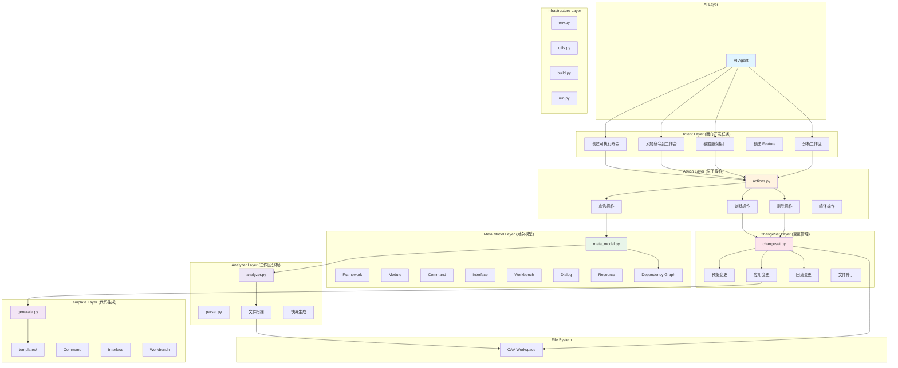

# CATIA CAA V5 开发助手架构设计 V2.0

> 📖 **本文档记录 V2.0 架构设计（历史文档）**。当前 V3.0 Kernel 架构请参阅 [SKILL.md](../../SKILL.md)。

## 🎯 设计理念

### 核心原则

1. **意图驱动，而非模板驱动**
   - AI 表达"创建可执行命令"，而非"创建 Command + Header + Catalog"
   - 隐藏 CAA 内部实现细节
   - 自动推理依赖关系

2. **结构化输出，而非字符串拼接**
   - 所有操作返回结构化 JSON
   - 可序列化的变更集
   - 便于 AI 继续处理

3. **可查询的工作区模型**
   - 完整的元模型（Meta Model）
   - 依赖图（Dependency Graph）
   - 快照式分析

4. **原子操作 + 可逆性**
   - 每个创建操作都有对应的删除
   - 变更集支持预览和回滚
   - 级联删除关联文件

5. **约束参数，避免猜测**
   - 从工作区查询可用选项
   - 验证参数有效性
   - 提供友好错误信息

---

## 📊 系统架构图



---

## 🏗️ 核心层次设计

### 1. Intent Layer（意图层）

**职责**: 理解开发任务，映射到原子操作

**示例**:
```python
# AI 调用
create_executable_command(
    name="MyCommand",
    module="MyModule.m",
    with_dialog=True,
    add_to_workbench="MyWorkbench"
)

# 内部自动分解为：
# 1. create_command()
# 2. create_dialog()
# 3. add_command_to_workbench()
# 4. 更新 Catalog
# 5. 更新 Dictionary
# 6. 生成 Icon
# 7. 生成 NLS
```

**不暴露的细节**:
- Framework 路径
- Imakefile 语法
- Dictionary 语法
- GUID 生成
- TIE/BOA 选择

### 2. Action Layer（原子操作层）

**职责**: 提供可组合的原子操作

**查询操作**:
```python
analyze_workspace(ctx) -> {
    "frameworks": [...],
    "modules": [...],
    "commands": [...],
    "dependency_graph": {...}
}

list_modules(ctx, framework=None) -> {
    "modules": [{"name": "...", "path": "...", "commands": [...]}]
}

list_commands(ctx, module=None) -> {
    "commands": [{"name": "...", "type": "...", "dialog": "..."}]
}

get_dependencies(ctx, command="MyCmd") -> {
    "depends_on": ["Dialog", "Resource", "Icon"],
    "depended_by": ["Workbench", "Catalog"]
}
```

**创建操作**:
```python
create_command(ctx, name, module, is_stateful=False, dialog_name=None) -> ChangeSet

create_workbench(ctx, name, module) -> ChangeSet

create_interface(ctx, name, module, methods=[]) -> ChangeSet

create_component(ctx, name, module, implements=[]) -> ChangeSet
```

**删除操作**:
```python
delete_command(ctx, name, module) -> ChangeSet
# 自动删除：
# - Command.cpp/.h
# - CommandHeader.cpp/.h
# - Catalog 条目
# - Icon
# - NLS
# - Dictionary 条目
```

### 3. Meta Model Layer（元模型层）

**职责**: 表示 CAA 工作区的完整对象模型

**核心对象**:
```python
class Framework:
    name: str
    path: Path
    modules: List[Module]
    identity_card: Optional[IdentityCard]

class Module:
    name: str
    framework: Framework
    path: Path
    commands: List[Command]
    interfaces: List[Interface]
    components: List[Component]
    dialogs: List[Dialog]
    imakefile: Imakefile

class Command:
    name: str
    module: Module
    type: CommandType  # Simple | Stateful
    header: Optional[CommandHeader]
    dialog: Optional[Dialog]
    catalog_entry: Optional[CatalogEntry]
    icon: Optional[Icon]
    nls: Optional[NLS]
    
    # 依赖关系
    belongs_to: Module
    has_dialog: Optional[Dialog]
    has_header: CommandHeader
    registered_in: List[Catalog]
    used_by: List[Workbench]

class DependencyGraph:
    nodes: Dict[str, Entity]
    edges: List[Tuple[Entity, Entity, RelationType]]
    
    def get_dependencies(self, entity: Entity) -> List[Entity]
    def get_dependents(self, entity: Entity) -> List[Entity]
    def find_cascade_delete(self, entity: Entity) -> List[Entity]
```

**依赖关系类型**:
```python
class RelationType(Enum):
    BELONGS_TO = "belongs_to"        # Command -> Module
    HAS = "has"                      # Command -> Dialog
    IMPLEMENTS = "implements"        # Component -> Interface
    EXTENDS = "extends"              # Interface -> Interface
    USES = "uses"                    # Workbench -> Command
    REGISTERED_IN = "registered_in"  # Command -> Catalog
```

### 4. ChangeSet Layer（变更管理层）

**职责**: 管理所有文件变更，支持预览和回滚

**ChangeSet 结构**:
```python
class ChangeSet:
    description: str
    operations: List[Operation]
    metadata: Dict
    
    # 操作类型
    class Operation:
        type: OperationType  # CREATE | MODIFY | DELETE
        path: Path
        content: Optional[str]
        patches: Optional[List[Patch]]
    
    # 核心方法
    def preview(self) -> Dict:
        """返回将要修改的文件列表"""
        return {
            "will_create": [...],
            "will_modify": [...],
            "will_delete": [...]
        }
    
    def apply(self, dry_run=False) -> Dict:
        """执行变更"""
        if dry_run:
            return self.preview()
        # 实际执行
        return {
            "created": [...],
            "modified": [...],
            "deleted": [...],
            "rollback_id": "..."
        }
    
    def rollback(self, rollback_id: str) -> Dict:
        """回滚变更"""
```

**变更示例**:
```json
{
  "description": "创建命令 MyCommand",
  "operations": [
    {
      "type": "CREATE",
      "path": "MyFramework.edu/MyModule.m/src/MyCommand.cpp",
      "content": "..."
    },
    {
      "type": "MODIFY",
      "path": "MyFramework.edu/MyModule.m/Imakefile.mk",
      "patches": [
        {
          "line": 10,
          "action": "insert",
          "content": "MyCommand.cpp \\"
        }
      ]
    }
  ]
}
```

### 5. Template Layer（模板层）

**职责**: 基于模板生成代码

**模板分类**:
```
templates/
├── structure/          # 项目结构
│   ├── framework/
│   ├── module/
│   └── identitycard/
│
├── command/            # 命令相关
│   ├── simple/
│   ├── stateful/
│   └── header/
│
├── ui/                 # 界面相关
│   ├── dialog/
│   ├── panel/
│   └── notification/
│
├── component/          # 组件相关
│   ├── component/
│   ├── adapter/
│   └── extension/
│
├── interface/          # 接口相关
│   ├── idl/
│   ├── cpp/
│   └── tie/
│
├── workbench/          # 工作台相关
│   ├── workbench/
│   └── addin/
│
├── feature/            # Feature 相关
│   ├── feature/
│   ├── factory/
│   └── catalog/
│
└── resource/           # 资源相关
    ├── catalog/
    ├── dictionary/
    ├── nls/
    └── icon/
```

**模板生成器**:
```python
class TemplateGenerator:
    def get_available_templates(self) -> List[TemplateInfo]
    
    def generate(self, template_type: str, context: Dict) -> GeneratedFiles
    
    def validate_context(self, template_type: str, context: Dict) -> ValidationResult
```

### 6. Analyzer Layer（分析层）

**职责**: 扫描工作区，生成快照

**工作流**:
```
Workspace
    ↓
Scanner (遍历文件系统)
    ↓
Parser (解析 Imakefile/Dictionary/Catalog)
    ↓
MetaModel Constructor
    ↓
DependencyGraph Builder
    ↓
WorkspaceSnapshot
```

**快照内容**:
```python
class WorkspaceSnapshot:
    timestamp: datetime
    workspace_path: Path
    frameworks: List[Framework]
    dependency_graph: DependencyGraph
    statistics: Statistics
    
    # 查询方法
    def find_framework(self, name: str) -> Optional[Framework]
    def find_module(self, name: str) -> Optional[Module]
    def find_command(self, name: str) -> Optional[Command]
    def find_interface(self, name: str) -> Optional[Interface]
    
    # 依赖查询
    def get_dependencies(self, entity: Entity) -> List[Entity]
    def get_dependents(self, entity: Entity) -> List[Entity]
    def get_cascade_delete_list(self, entity: Entity) -> List[Entity]
```

---

## 🔧 实现优先级

### Phase 1: 核心重构（第1周）

1. **增强 Meta Model**
   - 添加完整的依赖关系
   - 实现 DependencyGraph
   - 添加关系类型枚举

2. **重构 Actions**
   - 分离 Intent 和 Action
   - 添加参数验证
   - 返回结构化结果

3. **增强 ChangeSet**
   - 支持回滚
   - 添加元数据
   - 改进预览

### Phase 2: 高级功能（第2周）

4. **实现 Intent Layer**
   - create_executable_command()
   - expose_service()
   - create_feature()

5. **依赖图可视化**
   - 生成 Mermaid 图
   - 导出 DOT 格式

6. **智能推荐**
   - 根据上下文推荐操作
   - 检测潜在问题

### Phase 3: 优化和文档（第3周）

7. **性能优化**
   - 缓存机制
   - 增量分析

8. **完善文档**
   - API 文档
   - 架构图
   - 示例代码

9. **测试覆盖**
   - 单元测试
   - 集成测试
   - 端到端测试

---

## 📝 API 设计示例

### 查询 API

```python
# 1. 分析工作区（返回完整快照）
result = analyze_workspace(ctx)
{
    "status": "ok",
    "snapshot": {
        "frameworks": [...],
        "modules": [...],
        "commands": [...],
        "dependency_graph": {...}
    },
    "summary": {
        "framework_count": 3,
        "module_count": 12,
        "command_count": 45
    }
}

# 2. 查询依赖关系
result = get_dependencies(ctx, command="MyCommand")
{
    "status": "ok",
    "dependencies": [
        {"type": "dialog", "name": "MyDialog"},
        {"type": "resource", "name": "MyCommandIcon.png"},
        {"type": "catalog", "name": "MyWorkbench.CATNls"}
    ],
    "dependents": [
        {"type": "workbench", "name": "MyWorkbench"}
    ]
}

# 3. 列出可用模块（带验证）
result = list_modules(ctx, framework="MyFramework")
{
    "status": "ok",
    "modules": [
        {"name": "MyModule.m", "path": "...", "command_count": 5},
        {"name": "YourModule.m", "path": "...", "command_count": 3}
    ],
    "count": 2
}
```

### 创建 API

```python
# 1. 创建命令（预览模式）
result = create_command(ctx, 
    name="MyCommand",
    module="MyModule.m",
    framework="MyFramework",
    is_stateful=True,
    dialog_name="MyDialog"
)
{
    "status": "pending",
    "message": "准备创建命令 MyCommand",
    "changeset": {...},
    "preview": {
        "will_create": [
            "MyFramework.edu/MyModule.m/src/MyCommand.cpp",
            "MyFramework.edu/MyModule.m/LocalInterfaces/MyCommand.h",
            "MyFramework.edu/MyModule.m/src/MyCommandHeader.cpp",
            "MyFramework.edu/MyModule.m/src/MyDialog.cpp",
            "MyFramework.edu/CNext/resources/msgcatalog/MyCommand.CATNls",
            "MyFramework.edu/CNext/resources/graphic/icons/normal/MyCommand.png"
        ],
        "will_modify": [
            "MyFramework.edu/MyModule.m/Imakefile.mk",
            "MyFramework.edu/CNext/code/dictionary/MyFramework.dico"
        ]
    }
}

# 2. 应用变更
result = apply_changeset(ctx, changeset_id="...")
{
    "status": "success",
    "created": [...],
    "modified": [...],
    "rollback_id": "20260707_143022"
}

# 3. 回滚
result = rollback_changeset(ctx, rollback_id="...")
{
    "status": "success",
    "restored": [...]
}
```

### 删除 API

```python
# 删除命令（级联删除）
result = delete_command(ctx, 
    name="MyCommand",
    module="MyModule.m",
    framework="MyFramework"
)
{
    "status": "pending",
    "message": "准备删除命令 MyCommand 及其关联文件",
    "preview": {
        "will_delete": [
            "MyCommand.cpp",
            "MyCommand.h",
            "MyCommandHeader.cpp",
            "MyCommandHeader.h",
            "MyDialog.cpp",
            "MyDialog.h",
            "MyCommand.CATNls",
            "MyCommand.png"
        ],
        "will_modify": [
            "Imakefile.mk (移除 MyCommand.cpp)",
            "MyFramework.dico (移除注册项)",
            "MyWorkbench.CATNls (移除菜单项)"
        ]
    },
    "warnings": [
        "命令 MyCommand 被 MyWorkbench 使用，删除后工作台将失效"
    ]
}
```

---

## 🎯 设计目标对照表

| 最佳实践 | 当前实现 | V2.0 目标 | 状态 |
|---------|---------|----------|------|
| 不暴露模板给 AI | ✅ 已实现 | ✅ 完全隐藏 | ✅ 完成 |
| 暴露意图而非 Wizard | ✅ 已实现 | ✅ Intent Layer | ✅ 完成 |
| 建立对象模型 | ✅ 已实现 | ✅ 增强依赖图 | ✅ 完成 |
| 参数约束验证 | ✅ 已实现 | ✅ 完整验证 | ✅ 完成 |
| Skill 可查询 | ✅ 已实现 | ✅ 增强查询 | ✅ 完成 |
| 不直接修改文件 | ✅ ChangeSet | ✅ 支持回滚 | ✅ 完成 |
| 所有操作可逆 | ✅ 已实现 | ✅ 完整回滚 | ✅ 完成 |
| 返回结构化结果 | ✅ 已实现 | ✅ 完善 JSON | ✅ 完成 |
| 建立依赖图 | ✅ 已实现 | ✅ 完整依赖图 | ✅ 完成 |
| 原子 Skill | ✅ 已实现 | ✅ Intent Layer | ✅ 完成 |

---

## 📚 参考

- [CAA Reference](./CAA_REFERENCE.md)
- [Quick Decision Tree](./QUICK_DECISION_TREE.md)
- [AI Guide](../guides/AI_GUIDE.md)

---

**版本**: 2.0.0  
**更新日期**: 2026-07-08  
**状态**: 已发布
