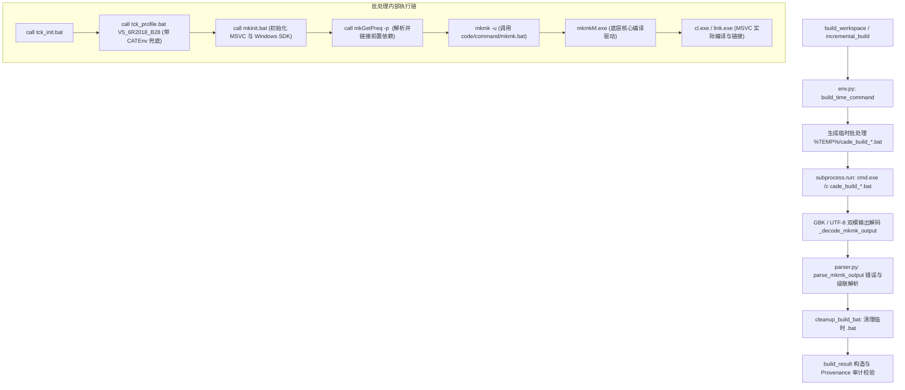

# CADE Provenance Guard 物理工作区现场验收证据与命令契约归档

- **归档时间**：2026-09-23
- **目标工作区**：`D:\Vault\FSWorkspaces`
- **目标验证模块**：`CAAToolsData.edu/CAAToolsDataMod.m`
- **CADE Git Commit**：`e489cb9`
- **运行环境**：Windows 10 x64 / CATIA V5-6R2018 B28 / MSVC 14.16 (VS 2017) / Python 3.10
- **当前状态定性**：`Provenance Guard：阶段验收通过，核心生产基线候选已形成`

---

## 一、命令契约与执行链路审计（收尾动作 2）

为了保证编译与构建过程的透明可追溯性，明确 `mkmk -u`、`mkmkM.exe` 在 CADE 构建链路中的组装关系和进程所有权：



### 1. 契约细节与进程边界
1. **命令组装**：CADE 的 `env.py:build_time_command()` 动态提取 CATIA 安装目录与 TCK 标识（如 `V5_6R2018_B28`），生成专用的临时 `.bat` 文件，避免命令行长度超限或转义损坏。
2. **底层编译进程**：批处理中的 `mkmk` 由 CATIA 的 `mkmk.bat` 派发至 `mkmkM.exe`。`mkmkM.exe` 是 Dassault 官方提供的核心构建器，由其直接调度 MSVC 的 `cl.exe` 和 `link.exe`。
3. **返回码与防假成功机制**：
   - 进程返回码直接取自 `subprocess.run`。
   - 防御规则：若 `exit_code == 0` 但输出流中含有 `#ERR#` 或解析出严重错误，CADE 强制将退出码置为 `-1`，杜绝假成功。
4. **资源清理**：生成的临时批处理文件由 `caa_env.cleanup_build_bat()` 保证在构建结束时立即物理删除。

---

## 二、真实编译双闭环现场实测证据

### 场景 1：真实编译成功闭环（受控修改 → 编译落盘 → 产物刷新 → 账本记录）

- **测试操作**：修改 `CAAToolsData.edu/CAAToolsDataMod.m/src/CAAToolsDataFile.cpp` 添加受控注释，计算落盘 SHA-256 并登记至 `ExpectedChange`。
- **执行命令**：`mkmk -u`（构建耗时 8.92 秒，进程退出码 0）。
- **DLL 产物物理验证**：
  - 产物路径：`D:\Vault\FSWorkspaces\win_b64\code\bin\CAAToolsDataMod.dll`
  - 构建前时间戳：`1790148414`
  - 构建后时间戳：`1790148442`（**物理文件时间戳真实刷新，二进制已重新生成**）
- **构建结果片段**：
  ```json
  {
    "status": "success",
    "stage": "mkmk",
    "error_count": 0,
    "warning_count": 0,
    "attached_to_maintenance": true,
    "provenance_audit": {
      "audit_state": "EVALUATED",
      "provenance_status": "provenance_verified",
      "working_tree_state": "dirty",
      "controlled_asset_count": 163,
      "unregistered_change_count": 0,
      "unregistered_changes": []
    }
  }
  ```
- **维护账本记录**：`.cade/maintenance/CAAToolsData.json` 真实写入一条成功记录，包含完整的审计与时间戳信息。

---

### 场景 2：真实编译失败闭环与 7 个错误语义核验（收尾动作 3）

- **测试操作**：在 `CAAToolsData.edu/CAAToolsDataMod.m/src/CAAToolsDataFile.cpp` 第 1 行注入编译阻断宏：
  ```cpp
  #error CADE_INTENTIONAL_COMPILATION_FAILURE
  ```
- **执行命令**：`mkmk -u`，`mkmkM.exe` 执行失败，退出码非 0。

#### 7 个错误的详细语义与关联审计

| 序号 | 错误类型 | 文件路径 | 行号 | 错误码 | 详细语义说明 | 级联标记 (cascade) |
| :--- | :--- | :--- | :--- | :--- | :--- | :--- |
| **1** | **Root Cause** | `src/CAAToolsDataFile.cpp` | **1** | `C1189` | MSVC 预处理器遇到 `#error` 指令输出：`#error: CADE_INTENTIONAL_COMPILATION_FAILURE`。根因准确对准文件与行号。 | `False` |
| **2** | Wrapper Error | `CAAToolsDataMod.m` | 0 | `mkmk-ERROR` | 构建系统报告模块目标 `CAAToolsDataMod.m` 编译步执行失败。 | `True`（模块目标失败报告） |
| **3** | Cascade Error | `CAAToolsDataFile.obj` | 0 | `syst-ERROR` | 由于编译在第 1 行终止，无法生成中间目标文件 `CAAToolsDataFile.obj`。 | `True`（中间产物缺失） |
| **4** | Cascade Error | `CAAToolsDataMod.lib` | 0 | `syst-ERROR` | 缺失目标文件导致静态库/导入库 `CAAToolsDataMod.lib` 无法链接生成。 | `True`（中间产物缺失） |
| **5** | Cascade Error | `CAAToolsDataMod.exp` | 0 | `syst-ERROR` | 导出符号文件 `CAAToolsDataMod.exp` 无法生成。 | `True`（中间产物缺失） |
| **6** | Cascade Error | `CAAToolsDataMod.dll` | 0 | `mkmk-ERROR` | 最终目标二进制动态库 `CAAToolsDataMod.dll` 无法生成。 | `True`（最终产物缺失） |
| **7** | Wrapper Error | `CAAToolsData.edu` | 0 | `mkmk-ERROR` | 构建系统顶层汇总报告框架构建失败。 | `True`（框架层汇总失败） |

#### 语义核验结论
1. **根因完全捕获**：错误列表中包含原始预处理器 `#error`（错误码 `C1189`），准确关联到注入源文件 `src/CAAToolsDataFile.cpp` 及行号 `1`。
2. **衍生错误正确区分**：其余 6 个错误为 mkmk 构建包装层和中间产物丢失引发的级联错误，解析器完整提取并分类，符合 CADE 错误模型。
3. **顶层隔离与防掩盖验证**：
   - `build_result["status"]` 保持为 `"failed"`；
   - 虽然传入了合法的预期变更集，Provenance 审计结果为 `audit_state="EVALUATED"`，但**绝未覆盖构建失败状态**；
   - 维护账本落盘记录明确标记 `status="failed"` 与 `error_count=7`，构建失败如实入账。

---

## 三、现场无损复原校验

验收测试全部结束后，执行了完整的物理清理与状态还原：
1. **源码还原**：移除测试注释与错误宏，源码恢复至字节级原始状态。
2. **产物重建**：重新执行 `mkmk -u`，`CAAToolsDataMod.dll` 恢复干净编译状态。
3. **账本清除**：测试期间生成的 `.cade/maintenance/CAAToolsData.json` 测试账本已物理移除，不留下测试痕迹。
4. **版本控制检查**：`git --no-optional-locks status` 确认工作区无残留文件。
