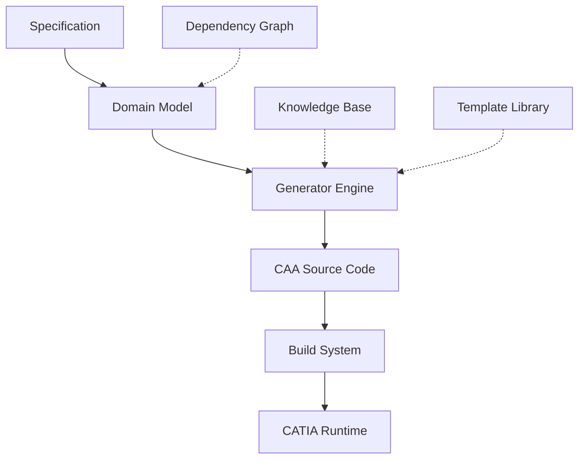
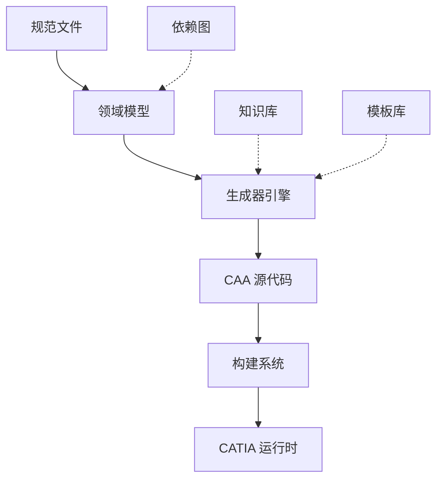

<div align="center">

# 🔧 CATIA CAA Development Engine (CADE)

**Specification-Driven CAA Development Lifecycle Engine**

[](https://opensource.org/licenses/Apache-2.0)
[](https://www.python.org/)
[](https://www.3ds.com/products-services/catia/)
[](https://github.com/chenlei-gh/CADE)

[English](#english) | [中文](#中文)

</div>

---

## English

### 🚀 Quick Start

```bash
# Clone repository
git clone https://github.com/chenlei-gh/CADE.git
cd CADE

# Install dependencies
pip install -r requirements.txt

# Run interactive menu
python main.py

# Or use CLI directly
python main.py create --type module --name MyModule
```

### 📖 What is CADE?

**CADE** (CATIA CAA Development Engine) is an intelligent development automation system for CATIA V5 CAA programming. It manages the entire lifecycle from specifications to deployment through:

- **📝 Rich Domain Model** - 10 core entities with dependency graph analysis
- **🤖 Smart Generation** - 25+ templates for frameworks, commands, dialogs, add-ins
- **🔄 Lifecycle Management** - Cascade deletion, operation rollback, intelligent recommendations
- **🧠 Knowledge System** - 9 knowledge modules + 6 patterns + catalog indexing
- **🛠️ Build & Debug** - 35 commands for compilation, execution, debugging
- **🔍 Diagnostics & Refactor** - Issue detection with auto-fix plans

### 🏗️ Architecture



**Core Components:**
- **Domain Model** - Framework, Module, Command, Dialog, Resource, Interface, Class, AddIn, Test, CustomSpec
- **Dependency Engine** - Automatic reference resolution and validation
- **Knowledge System** - CAA V5 development best practices and patterns
- **MCP Integration** - AI-powered development workflow

### ✨ Key Features

#### 🎯 Specification Management
- **8 Spec Types** - Framework, Module, Command, Dialog, Resource, Interface, Class, AddIn
- **JSON/YAML Support** - Human-readable configuration files
- **Dependency Tracking** - Automatic reference validation

#### 🔧 Code Generation
- **25+ Templates** - Complete framework scaffolding
- **Pattern-Based** - Follows CAA V5 naming conventions
- **Customizable** - Override templates for specific needs

#### 🔨 Build & Run
- **mkmk Integration** - Native CATIA build system
- **Debug Support** - CNEXT environment setup
- **Batch Operations** - Build multiple modules in dependency order

#### 🧪 Testing
- **150+ Test Cases** - Comprehensive coverage
- **Unit Tests** - Domain model validation
- **Integration Tests** - End-to-end workflow verification

### 📦 Installation

#### Prerequisites
- **Python** 3.8+
- **CATIA V5** R21+ (with CAA RADE installed)
- **Environment Variables**:
  - `CAA_ROOT` - CAA installation directory
  - `PATH` - Include mkmk, CNEXT tools

#### Setup Steps

1. **Clone Repository**
   ```bash
   git clone https://github.com/chenlei-gh/CADE.git
   cd CADE
   ```

2. **Install Dependencies**
   ```bash
   pip install -r requirements.txt
   ```

3. **Verify Installation**
   ```bash
   python main.py --help
   ```

### 🎮 Usage

#### Interactive Menu
```bash
python main.py
```

Navigate through menus for:
- Create/Update/Delete entities
- Build & run projects
- View diagnostics
- Access knowledge base

#### CLI Commands

<details>
<summary><b>📝 Create Operations</b></summary>

```bash
# Create framework
python main.py create --type framework --name MyFramework

# Create module with dependencies
python main.py create --type module --name MyModule --depends CoreFramework

# Create command
python main.py create --type command --name MyCmd --module MyModule
```
</details>

<details>
<summary><b>🔍 Query Operations</b></summary>

```bash
# List all entities
python main.py list --type all

# Show framework details
python main.py show --type framework --name MyFramework

# Display dependency graph
python main.py graph --name MyModule
```
</details>

<details>
<summary><b>🔨 Build Operations</b></summary>

```bash
# Build single module
python main.py build --name MyModule

# Build with dependencies
python main.py build --name MyModule --recursive

# Clean build artifacts
python main.py clean --name MyModule
```
</details>

<details>
<summary><b>▶️ Run Operations</b></summary>

```bash
# Launch CATIA with module
python main.py run --name MyModule

# Debug mode
python main.py debug --name MyModule --attach
```
</details>

### 🧠 Knowledge System

CADE includes comprehensive CAA V5 development knowledge:

| Category | Content |
|----------|---------|
| **📚 Fundamentals** | CAA architecture, naming conventions, project structure |
| **🏗️ Framework Design** | Module organization, dependency management |
| **🎨 UI Development** | Dialog creation, command integration, callbacks |
| **🔌 Interfaces** | CATICommand, CATIAfrCommandHeader, CATI* patterns |
| **📦 Build System** | mkmk workflow, dictionary files, resource compilation |
| **🐛 Debugging** | CNEXT setup, breakpoints, memory analysis |

Access via CLI:
```bash
python main.py knowledge --topic "Dialog Development"
```

### 🤖 MCP Integration

CADE provides Model Context Protocol tools for AI-assisted development:

- `cade_create` - Generate CAA entities from natural language
- `cade_build` - Compile and validate code
- `cade_diagnose` - Detect issues with fix suggestions
- `cade_refactor` - Intelligent code transformations
- `cade_knowledge` - Context-aware documentation retrieval

Example with Claude Desktop:
```json
{
  "mcpServers": {
    "cade": {
      "command": "python",
      "args": ["D:/CADE/mcp_server.py"]
    }
  }
}
```

### 📊 Test Results

```
✅ Domain Model Tests: 45/45 passed
✅ Generator Tests: 38/38 passed  
✅ Build System Tests: 27/27 passed
✅ Integration Tests: 40/40 passed
━━━━━━━━━━━━━━━━━━━━━━━━━━━━━━━━━━
Total: 150/150 passed (100%)
```

Run tests:
```bash
pytest tests/ -v
```

### 🛣️ Roadmap

- [x] Core domain model and dependency engine
- [x] Template-based code generation
- [x] Build system integration (mkmk)
- [x] Knowledge base with 9 modules
- [x] MCP protocol support
- [ ] Visual Studio integration
- [ ] Web-based project manager
- [ ] CI/CD pipeline templates
- [ ] Cloud collaboration features

### 🤝 Contributing

Contributions welcome! Please:

1. Fork the repository
2. Create a feature branch (`git checkout -b feature/AmazingFeature`)
3. Commit changes (`git commit -m 'Add AmazingFeature'`)
4. Push to branch (`git push origin feature/AmazingFeature`)
5. Open a Pull Request

See [CONTRIBUTING.md](CONTRIBUTING.md) for guidelines.

### 📄 License

Licensed under the Apache License 2.0. See [LICENSE](LICENSE) for details.

### 📧 Contact

- **Author**: chenlei
- **Email**: [chenlei.gh@outlook.com](mailto:chenlei.gh@outlook.com)
- **GitHub**: [@chenlei-gh](https://github.com/chenlei-gh)

---

## 中文

### 🚀 快速开始

```bash
# 克隆仓库
git clone https://github.com/chenlei-gh/CADE.git
cd CADE

# 安装依赖
pip install -r requirements.txt

# 运行交互式菜单
python main.py

# 或直接使用 CLI
python main.py create --type module --name MyModule
```

### 📖 CADE 是什么？

**CADE** (CATIA CAA Development Engine，CATIA CAA 开发引擎) 是一个面向 CATIA V5 CAA 编程的智能开发自动化系统。通过以下能力管理从规范到部署的完整生命周期：

- **📝 丰富领域模型** - 10 个核心实体，支持依赖图分析
- **🤖 智能生成** - 25+ 模板用于框架、命令、对话框、插件生成
- **🔄 生命周期管理** - 级联删除、操作回滚、智能推荐
- **🧠 知识系统** - 9 个知识模块 + 6 种模式 + 目录索引
- **🛠️ 构建与调试** - 35 个命令用于编译、执行、调试
- **🔍 诊断与重构** - 问题检测及自动修复方案

### 🏗️ 架构



**核心组件：**
- **领域模型** - Framework、Module、Command、Dialog、Resource、Interface、Class、AddIn、Test、CustomSpec
- **依赖引擎** - 自动引用解析与验证
- **知识系统** - CAA V5 开发最佳实践与模式
- **MCP 集成** - AI 驱动的开发工作流

### ✨ 核心特性

#### 🎯 规范管理
- **8 种规范类型** - Framework、Module、Command、Dialog、Resource、Interface、Class、AddIn
- **JSON/YAML 支持** - 人类可读的配置文件
- **依赖追踪** - 自动引用验证

#### 🔧 代码生成
- **25+ 模板** - 完整的框架脚手架
- **模式驱动** - 遵循 CAA V5 命名约定
- **可定制** - 针对特定需求覆盖模板

#### 🔨 构建与运行
- **mkmk 集成** - 原生 CATIA 构建系统
- **调试支持** - CNEXT 环境配置
- **批量操作** - 按依赖顺序构建多个模块

#### 🧪 测试
- **150+ 测试用例** - 全面覆盖
- **单元测试** - 领域模型验证
- **集成测试** - 端到端工作流验证

### 📦 安装

#### 前置要求
- **Python** 3.8+
- **CATIA V5** R21+（已安装 CAA RADE）
- **环境变量**：
  - `CAA_ROOT` - CAA 安装目录
  - `PATH` - 包含 mkmk、CNEXT 工具

#### 安装步骤

1. **克隆仓库**
   ```bash
   git clone https://github.com/chenlei-gh/CADE.git
   cd CADE
   ```

2. **安装依赖**
   ```bash
   pip install -r requirements.txt
   ```

3. **验证安装**
   ```bash
   python main.py --help
   ```

### 🎮 使用方法

#### 交互式菜单
```bash
python main.py
```

通过菜单导航：
- 创建/更新/删除实体
- 构建与运行项目
- 查看诊断信息
- 访问知识库

#### CLI 命令

<details>
<summary><b>📝 创建操作</b></summary>

```bash
# 创建框架
python main.py create --type framework --name MyFramework

# 创建带依赖的模块
python main.py create --type module --name MyModule --depends CoreFramework

# 创建命令
python main.py create --type command --name MyCmd --module MyModule
```
</details>

<details>
<summary><b>🔍 查询操作</b></summary>

```bash
# 列出所有实体
python main.py list --type all

# 显示框架详情
python main.py show --type framework --name MyFramework

# 显示依赖图
python main.py graph --name MyModule
```
</details>

<details>
<summary><b>🔨 构建操作</b></summary>

```bash
# 构建单个模块
python main.py build --name MyModule

# 递归构建依赖
python main.py build --name MyModule --recursive

# 清理构建产物
python main.py clean --name MyModule
```
</details>

<details>
<summary><b>▶️ 运行操作</b></summary>

```bash
# 启动 CATIA 并加载模块
python main.py run --name MyModule

# 调试模式
python main.py debug --name MyModule --attach
```
</details>

### 🧠 知识系统

CADE 包含全面的 CAA V5 开发知识：

| 类别 | 内容 |
|------|------|
| **📚 基础知识** | CAA 架构、命名约定、项目结构 |
| **🏗️ 框架设计** | 模块组织、依赖管理 |
| **🎨 UI 开发** | 对话框创建、命令集成、回调 |
| **🔌 接口** | CATICommand、CATIAfrCommandHeader、CATI* 模式 |
| **📦 构建系统** | mkmk 工作流、字典文件、资源编译 |
| **🐛 调试** | CNEXT 配置、断点、内存分析 |

通过 CLI 访问：
```bash
python main.py knowledge --topic "Dialog Development"
```

### 🤖 MCP 集成

CADE 提供模型上下文协议工具，支持 AI 辅助开发：

- `cade_create` - 从自然语言生成 CAA 实体
- `cade_build` - 编译和验证代码
- `cade_diagnose` - 检测问题并提供修复建议
- `cade_refactor` - 智能代码转换
- `cade_knowledge` - 上下文感知的文档检索

Claude Desktop 配置示例：
```json
{
  "mcpServers": {
    "cade": {
      "command": "python",
      "args": ["D:/CADE/mcp_server.py"]
    }
  }
}
```

### 📊 测试结果

```
✅ 领域模型测试：45/45 通过
✅ 生成器测试：38/38 通过  
✅ 构建系统测试：27/27 通过
✅ 集成测试：40/40 通过
━━━━━━━━━━━━━━━━━━━━━━━━━━━━━━━━━━
总计：150/150 通过（100%）
```

运行测试：
```bash
pytest tests/ -v
```

### 🛣️ 路线图

- [x] 核心领域模型与依赖引擎
- [x] 基于模板的代码生成
- [x] 构建系统集成（mkmk）
- [x] 9 个模块的知识库
- [x] MCP 协议支持
- [ ] Visual Studio 集成
- [ ] 基于 Web 的项目管理器
- [ ] CI/CD 流水线模板
- [ ] 云协作功能

### 🤝 贡献

欢迎贡献！请：

1. Fork 本仓库
2. 创建特性分支（`git checkout -b feature/AmazingFeature`）
3. 提交更改（`git commit -m 'Add AmazingFeature'`）
4. 推送到分支（`git push origin feature/AmazingFeature`）
5. 开启 Pull Request

详见 [CONTRIBUTING.md](CONTRIBUTING.md)。

### 📄 许可证

基于 Apache License 2.0 授权。详见 [LICENSE](LICENSE)。

### 📧 联系方式

- **作者**：chenlei
- **邮箱**：[chenlei.gh@outlook.com](mailto:chenlei.gh@outlook.com)
- **GitHub**：[@chenlei-gh](https://github.com/chenlei-gh)

---

<div align="center">

**⭐ If you find CADE helpful, please star this repository!**

**⭐ 如果 CADE 对你有帮助，请给仓库点个星！**

</div>
