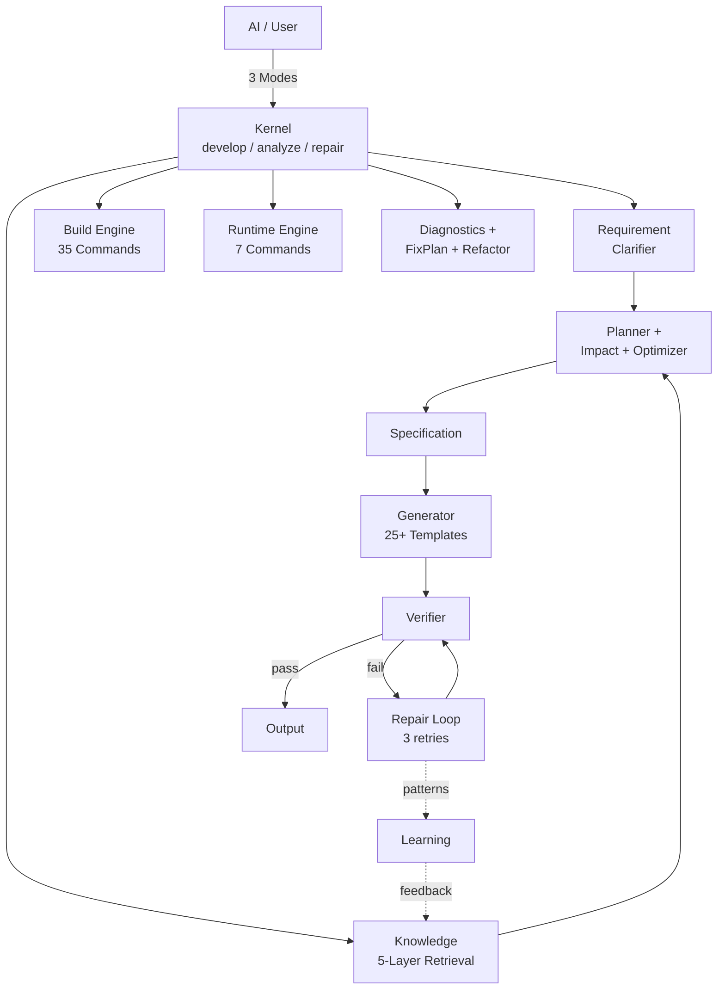

<div align="center">


</div>

<div align="center">

<pre>
   ██████╗  █████╗ ██████╗ ███████╗
  ██╔════╝ ██╔══██╗██╔══██╗██╔════╝
  ██║      ███████║██║  ██║█████╗  
  ██║      ██╔══██║██║  ██║██╔══╝  
  ╚██████╗ ██║  ██║██████╔╝███████╗
   ╚═════╝ ╚═╝  ╚═╝╚═════╝ ╚══════╝
</pre>

</div>

---

# CADE v3.0.0 — CATIA CAA Development Kernel

<div align="center">

### 🎯 AI-Powered CATIA CAA Development. *One command. Eight files. Done.*

From "I need a dialog command" to compiling code — without touching RADE wizards.

**[Quick Start](#-quick-start) · [Why CADE?](#-why-cade) · [Commands](#-what-it-can-do) · [Docs](.agents/skills/catia-caa-dev/docs/) · [中文](#-中文)**

</div>

> 🟢 **CI Status**: `32/32 suites (100%)` | **32 test files** | **~600 checks** | *2026-07-11*

---

## ⚡ Quick Start

```bash
# 1. Clone into your CAA project
git clone https://github.com/chenlei-gh/CADE.git
cp -r CADE/.agents /path/to/your/caa/project/

# 2. That's it. Open in your editor.
#    CADE auto-detects CATIA. Zero config.
```

> [!TIP]
> **Zed** — works out of the box.  
> **Claude / Cursor / VS Code / Windsurf** — run `python .agents/skills/catia-caa-dev/tools/setup_mcp.py`

<details><summary>📋 Manual MCP setup</summary>

```json
{
  "mcpServers": {
    "cade": {
      "command": "python",
      "args": ["skills/mcp_server.py"],
      "cwd": ".agents/skills/catia-caa-dev"
    }
  }
}
```
</details>

---

## 🔥 Why CADE?

| Without CADE | With CADE |
|---|---|
| Create command manually (8 files) | One command: `cade create` |
| Click through RADE wizards | Tell AI in natural language |
| Multi-step build/run workflow | `cade build && cade run` |
| Guess what broke | `cade diagnose && cade fix` |
| No undo for mistakes | `cade rollback --id latest` |
| Wasted AI context tokens | Auto 50% token savings |

---

## 🧠 What's New

### 🧬 Development Kernel (v3.0)

CADE evolves from a tool collection to a **Development Kernel** — AI knows only 3 modes:

```
develop()   — create/generate (Command, may modify)
analyze()   — query/diagnose (Query, read-only)
repair()    — fix/refactor  (Command, with recovery)
```

- **Kernel** — 3-mode unified entry, internal state machine + dynamic dispatch
- **Requirement Clarifier** — vague intent → structured decisions (decision trees)
- **Planner** — Intent + Requirements → optimal DevelopmentPlan
- **Verifier** — static code check (no mkmk needed) + compile-check via mkmk
- **Repair Loop** — diagnose → fix → verify, up to 3 retries
- **Learning** — feedback loop, pattern detection → auto-suggest Playbooks

→ 41 MCP tools collapsed to **3 modes**. AI never needs to know internals.

### 📉 Token Optimizer

All MCP responses are **auto-optimized** for AI consumption. Key data preserved, noise removed.

```
API call       Raw     Optimized   Saved
analyze        341 →   28         91%
suggest_next   272 →   28         89%
spec_to_dict   162 →   44         72%
─────────────────────────────────────
Total average: 50% savings
```

### 🧩 Intent Engine

**Plan before execute.** Complex tasks become structured workflows.

```bash
cade plan CreateCommandWithDialog MyCmd MyModule
# → 8 steps: ensure_module → create_command → ... → update_imakefile

cade impact IMyInterface interface delete
# → CRITICAL: 12 affected files, snapshot recommended
```

- **Planner** — Intent → DevelopmentPlan (task decomposition)
- **Impact Analyzer** — Assess blast radius before refactoring  
- **Optimizer** — Score & rank alternative plans

### 🎨 Advanced UI Layout Knowledge

CADE now covers **every CAA UI layout scenario** — from simple forms to complex wizards:

| Pattern | Use Case |
|---------|----------|
| **GridConstraints** | 7 anchor types, span, stretch strategies |
| **Multi-layer nesting** | 3-5 layer Frame hierarchy patterns |
| **Master-Detail** | SelectorList + Properties panel (BOM editor) |
| **Dynamic Form** | Combo-driven panel show/hide |
| **Tree Navigation** | CATDlgTree + tab-based content area |
| **Wizard** | State-machine-driven Back/Next multi-step |
| **Splitter** | User-resizable left/right panes |
| **Anti-Patterns** | 10 common mistakes → correct approach |

→ `knowledge/ui/` now has **9 files** covering every UI angle.

### 📐 New Knowledge Domains

Three new CAA domains unlocked — powered by 6 knowledge files + 3 patterns:

| Domain | Knowledge | Pattern | Use Case |
|--------|-----------|---------|----------|
| **Drawing** | Views, annotations, BOM tables | Batch drawing generation | Auto-drawings |
| **Surface/GSD** | Extrude, sweep, flatten, join | Surface analysis automation | Surface flattening |
| **FTA / 3D PMI** | Capture, annotation, tolerance | Auto-annotation generation | 3D PMI |

### 🧠 5-Layer Knowledge Architecture

CADE now organizes knowledge in **5 layers** — AI finds answers 10x faster:

```
🎯 Capability (10)  → "What can CATIA do?"        AI entry point
📋 Playbook   (2)   → "How to accomplish this?"    Battle-tested recipes
📚 Knowledge  (29)  → "How to use this API?"       Code reference
🗂 Framework  (149) → "Which framework?"           CAADoc navigation
📖 CAADoc          → "What's the exact API?"      Official docs
```

Retrieval path: **Capability → Playbook → Knowledge → Framework → CAADoc**

→ **234 total knowledge assets** (29K + 13P + 13C + 6PB + 149FW + 1E + 6PH + 3FP)

### 🔍 Deep Audit

26-suite test suite catches drift early:

```bash
cade test --quick   # 31 suites (~8s), quick mode skips CATIA tests
cade test           # 32 suites (~60s), full including CATIA lifecycle
```

> 🟢 **Verified**: 32/32 suites (100%) — last full run 2026-07-11

- **Link Checker** — 101 internal links validated
- **Import Validator** — All Python imports resolvable
- **Version Consistency** — 3.0.0 unified across all docs
- **Hardcoded Path Detection** — 92 files scanned

---

## 🧰 What It Can Do

### 🏗️ Create
```bash
cade create command MyCmd MyModule --dialog --wb MyWb
cade create feature  MyFeature MyModule
cade create extension MyExt CATPart MyModule
```
→ Generates `.cpp`, `.h`, Header, Catalog, NLS, Icon, Dictionary, Imakefile — **all 8 files in one call**.

### 🔨 Build & Run
```bash
cade build                          # incremental (mkmk -u)
cade build --full --threads 8       # full rebuild, 8 threads
cade run                            # start CATIA Runtime View
cade run --macro test.CATScript     # run a macro
cade run --stop                     # stop all CATIA processes
```

### 🔍 Analyze & Fix
```bash
cade analyze                        # full workspace scan
cade analyze --graph                # Mermaid dependency diagram
cade diagnose                       # find issues
cade fix --apply                    # auto-fix broken references
cade validate                       # integrity check
```

### ♻️ Refactor & Rollback
```bash
cade refactor rename OldCmd NewCmd --module MyModule
cade refactor move MyCmd --from M1 --to M2
cade snapshot                     # checkpoint
cade rollback --id latest         # undo anything
```

### 🤖 AI & Docs
```bash
cade suggest                      # AI recommends next action
cade docs                         # auto-generate documentation
cade prereq MyModule              # view prerequisites
cade rv                           # create Runtime View
cade test --quick                 # run all 31 suites (~8s)
cade test                         # full: 32 suites (~60s)
```

> 🔌 Also available as **MCP Server** (3 modes) and **Python API** (~80 functions) — [see docs](.agents/skills/catia-caa-dev/docs/).

### ⚡ Test Results

<details>
<summary>32/32 suites (100%) · 32 files · ~600 checks · 2026-07-11</summary>

| | | |
|---|---|---|
| L1 Unit(49) ✅ | L1-2 Decomposer ✅ | L2 DepGraph ✅ |
| L2 Intent ✅ | L2 Rollback ✅ | L2 Enhanced ✅ |
| L2 Spec ✅ | L2 Diag ✅ | L2 FixPlan ✅ |
| L2 Refactor ✅ | L3 E2E ✅ | L4 Arch(29) ✅ |
| L5 Sem(40) ✅ | L6 Fault(16) ✅ | L7 Know(16) ✅ |
| L0 Kernel ✅ | L0 Req ✅ | L0 Repair ✅ |
| Int1 Build ✅ | Int2 Skill ✅ | FullSys ✅ |
| CrossRef ✅ | Token ✅ | CAA Struct ✅ |
| Intent ✅ | AI Integ ✅ | TokenAudit ✅ |
| DeepAudit ✅ | | |

</details>

```bash
python .agents/skills/catia-caa-dev/tests/test_master.py --quick   # 31 suites (~8s)
python .agents/skills/catia-caa-dev/tests/test_master.py           # 32 suites (~60s)
```

---

## 🏛 Architecture

### Knowledge Retrieval (5-Layer)

```
User Intent
    ↓
🎯 Capability    "What can CATIA do?"    13 files
    ↓
📋 Playbook      "How to accomplish?"     6 files
    ↓
📚 Knowledge     "How to use this API?"  29 files
    ↓
🗂 Framework     "Which framework?"      149 files
    ↓
📖 CAADoc        "Exact API signature"   Official
```

### Engine Architecture



> **Philosophy**: Capability grows by accumulating knowledge assets, not by modifying code.

---

## 📊 By the Numbers

| | |
|---|---|
| Suites | 32 (L1-L7 + Integration + Audit) |
| Files | 32 (31 suites + 1 standalone) |
| Checks | ~600 |
| Pass Rate | 100% |
| Templates | 25+ |
| APIs | 15 (Intent + Action) |
| CLI Commands | 22 |
| MCP Modes | 3 |
| Build Commands | 35 |
| Spec Types | 8 |
| Refactor Ops | 3 |
| Domain Entities | 10 |
| Knowledge Assets | 234 (29K + 13P + 13C + 6PB + 149FW + 1E + 6PH + 3FP) |

---

## 📂 Project Structure

```text
your_project/
├── .agents/skills/catia-caa-dev/   ← CADE (drop-in)
    ├── skills/                     ← Engine (28 modules)
    ├── templates/                  ← 25+ code templates
    ├── capabilities/               ← 13 core CAA capabilities
    ├── playbooks/                  ← Solution playbooks
    ├── knowledge/                  ← CAA API reference (8 domains + 149 frameworks)
    ├── patterns/                   ← Architecture patterns (13 patterns)
    ├── examples/                   ← Real CAA projects
    │   ├── tests/                      ← 32 suites, ~600 checks
    ├── tools/                      ← Setup, validation, utilities
    ├── config/                     ← Editor MCP templates
    └── docs/                       ← Full documentation
├── MyFramework.edu/
├── MyModule.m/
└── ...
```

---

## 🇨🇳 中文

### ❓ 是什么？

**CADE** 是 CATIA CAA V5 的 AI 驱动开发引擎。用自然语言告诉 AI "创建一个带对话框的命令"，引擎自动生成 8 个文件。一句命令替代 RADE 向导的多次点击。

```bash
cade create command 我的命令 我的模块 --dialog --wb 我的工作台
```

### ⚡ 快速开始

```bash
git clone https://github.com/chenlei-gh/CADE.git
cp -r CADE/.agents /你的/CAA/项目/路径/
# 用编辑器打开项目。CADE 自动检测 CATIA，零配置。
```

> [!TIP]
> **Zed** — 开箱即用。
> **Claude / Cursor / VS Code / Windsurf** — 运行 `python .agents/skills/catia-caa-dev/tools/setup_mcp.py`

### 🧠 最新更新

**🧬 Development Kernel (v3.0)** — 从工具集合升级为开发内核。AI 只需知道 3 个 Mode：`develop`（创建/生成）、`analyze`（查询/诊断）、`repair`（修复/重构）。41 个 MCP 工具压缩为 3 个入口，Kernel 内部自动调度需求分析、规划、生成、验证和修复全链路。

**📉 Token 优化器** — MCP 响应自动压缩，平均节省 50% token。

**🧩 Intent Engine** — 复杂任务自动分解为可执行步骤。Planner（意图→计划）+ Impact Analyzer（影响分析）+ Optimizer（方案排序）。

**🎨 高级 UI 布局** — 9 个知识文件覆盖 CAA UI 每个角落：

| 模式 | 场景 |
|------|------|
| GridConstraints | 7 种锚定、跨行跨列、伸缩策略 |
| 多层嵌套 | 3-5 层 Frame 层级结构 |
| 列表-详情 | 选择器 + 属性面板（BOM 编辑器） |
| 动态表单 | Combo 切换 → 面板显示/隐藏 |
| 树形导航 | CATDlgTree + Tab 内容区 |
| 向导 | 状态机驱动的 Back/Next 多步骤 |
| 反模式 | 10 种常见错误 → 正确做法 |

**📐 三大新领域** — 6 个知识文件 + 3 个开发模式：

| 领域 | 知识 | 模式 | 用途 |
|------|------|------|------|
| **工程图** | 视图、标注、BOM表 | 批量出图 | 自动生成图纸 |
| **曲面/GSD** | 拉伸/扫掠/展平/缝合 | 曲面分析 | 表皮展平 |
| **FTA 3D标注** | 标注集/尺寸/公差 | 自动标注 | 3D PMI |

### 🔥 为什么选 CADE？

| ❌ 没有 CADE | ✅ 有 CADE |
|---|---|
| 手动创建 8 个文件 | `cade create command 我的命令 我的模块` |
| 操作 RADE 向导，多次点击 | 告诉 AI："创建一个带对话框的命令" |
| `mkmk` → `mkCreateRuntimeView` → `CNEXT` | `cade build && cade run` |
| 重构后猜测哪里坏了 | `cade diagnose && cade fix --apply` |
| 误删了没法恢复 | `cade rollback --id latest` |
| AI 上下文被冗长输出浪费 | Token 优化器自动节省 50% token |
| 重构前拍脑袋猜影响范围 | `cade impact IMyInterface delete` |

### 🧰 能做什么

**🏗️ 创建**
```bash
cade create command  我的命令 我的模块 --dialog --wb 我的工作台
cade create feature  我的Feature 我的模块
cade create extension 我的扩展 CATPart 我的模块
```
→ 一次调用生成 .cpp、.h、Header、Catalog、NLS、Icon、Dictionary、Imakefile

**🔨 编译运行**
```bash
cade build                          # 增量编译
cade build --full --threads 8       # 全量编译
cade run                            # 启动 CATIA Runtime View
cade run --stop                     # 停止 CATIA
```

**🔍 分析修复**
```bash
cade analyze --graph                # Mermaid 依赖图
cade diagnose                       # 诊断问题
cade fix --apply                    # 自动修复
cade validate                       # 完整性检查
cade impact IMyInterface delete     # 影响分析
```

**♻️ 重构回滚**
```bash
cade refactor rename 旧命令 新命令 --module 我的模块
cade snapshot                       # 快照
cade rollback --id latest           # 撤销任意操作
```

**🤖 AI 辅助**
```bash
cade suggest                        # AI 推荐下一步
cade docs                           # 自动生成文档
cade test --quick                   # 31 套件快速测试 (~8s)
cade test                           # 32 套件全量测试 (~60s)
```

### ⚡ 测试结果

<details>
<summary>32/32 套件 (100%) · 32 文件 · ~600 检查 · 2026-07-11</summary>

| | | |
|---|---|---|
| L1 单元(49) ✅ | L1-2 分解器 ✅ | L2 依赖图 ✅ |
| L2 Intent ✅ | L2 回滚 ✅ | L2 增强 ✅ |
| L2 Spec ✅ | L2 诊断 ✅ | L2 FixPlan ✅ |
| L2 重构 ✅ | L3 E2E ✅ | L4 架构(29) ✅ |
| L5 语义(40) ✅ | L6 故障(16) ✅ | L7 知识(16) ✅ |
| L0 核心 ✅ | L0 Req ✅ | L0 修复 ✅ |
| Int1 构建 ✅ | Int2 协同 ✅ | 全系统 ✅ |
| CrossRef ✅ | Token ✅ | CAA结构 ✅ |
| Intent ✅ | AI集成 ✅ | Token审计 ✅ |
| 深度审计 ✅ | | |

</details>

### 🏛 架构

```
AI / CLI / MCP
     ↓
Intent Engine（Planner + Impact + Optimizer）
     ↓
Specification → Validation → Generator → ChangeSet → File System
     ↓
CodeModel（10 实体）+ DependencyGraph + Diagnostics + FixPlan
     ↓
Build Engine（35 命令）+ Runtime Engine（7 命令）+ Rollback
     ↓
Knowledge System（29 Knowledge + 13 Pattern + 1 Example）
```

> **核心理念**：系统能力增长靠沉淀知识资产，不靠修改代码。

### 📊 数据

| | |
|---|---|
| **测试套件** | 32（L1-L7 + Integration + Audit） |
| **测试文件** | 32（31 套件 + 1 独立） |
| **检查项** | ~600 |
| **通过率** | 100% |
| **模板** | 25+ |
| **API** | 15（Intent + Action） |
| **CLI 命令** | 22 |
| **MCP 模式** | 3 |
| **Build 命令** | 35 |
| **Spec 类型** | 8 |
| **重构操作** | 3 |
| **领域实体** | 10 |
| **知识资产** | 234（29K + 13P + 13C + 6PB + 149FW + 1E + 6PH + 3FP）

### 📂 项目结构

```text
你的项目/
├── .agents/skills/catia-caa-dev/   ← CADE（直接放入即可）
    ├── skills/                     ← 引擎（28 模块）
    ├── templates/                  ← 25+ 代码模板
    ├── capabilities/               ← 13 个核心能力
    ├── playbooks/                  ← 解决方案
    ├── knowledge/                  ← CAA API 参考（8 领域 + 149 框架）
    ├── patterns/                   ← 13 个开发模式
    ├── tests/                      ← 28 测试文件，~600 检查
    └── docs/                       ← 完整文档
├── MyFramework.edu/
├── MyModule.m/
└── ...
```

---

## 📜 License

MIT © [chenlei-gh](https://github.com/chenlei-gh) · [LICENSE](.agents/skills/catia-caa-dev/LICENSE)

---

<div align="center">

**[📖 Documentation](.agents/skills/catia-caa-dev/docs/) · [🏗️ Architecture](.agents/skills/catia-caa-dev/docs/references/ARCHITECTURE.md) · [📝 Changelog](.agents/skills/catia-caa-dev/CHANGELOG.md)**

</div>
