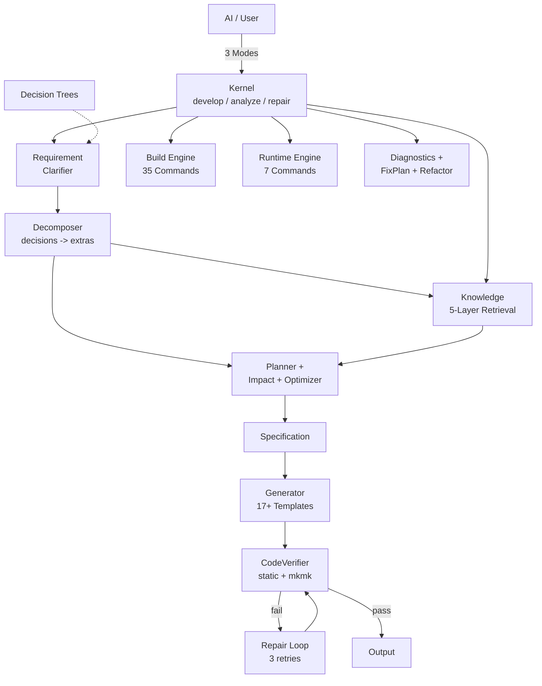

<div align="center">


</div>

<div align="center">

<pre>
   ██████╗  █████╗ ██████╗ ███████╗
  ██╔════╝ ██╔══██╗██╔══██╗██╔════╝
  ██║      ███████║██║  ██║█████╗  
  ██║      ██╔══██║██║  ██║██╔══╝  
  ╚██████╗ ██║  ██║██████╔╝███████╗
   ╚═════╝ ╚═╝  ╚═╝╚═════╝ ╚══════╝
</pre>

🟥🟥🟥🟥&ensp;🟦🟦🟦🟦&ensp;🟪🟪🟪🟪&ensp;🟩🟩🟩🟩&ensp;🟪🟪🟪🟪&ensp;🟧🟧🟧🟧&ensp;🩵🩵🩵🩵

<sub>Mfg · Assembly · Geometry · Analysis · Settings · Data · Test</sub>

</div>

---

# CADE — CATIA CAA Development Kernel

<div align="center">

### 🎯 AI-Powered CATIA CAA Development. *One command. Eight files. Done.*

From "I need a dialog command" to compiling code — without touching RADE wizards.

**[Quick Start](#-quick-start) · [Why CADE?](#-why-cade) · [Commands](#-what-it-can-do) · [Docs](.agents/skills/catia-caa-dev/docs/) · [中文](#-中文)**

</div>

> 🟢 **CI Status**: `35/35 suites (100%)` | **~600 checks** | *2026-07-16*

> **v3.2.1** — Generate → Build → Run closed loop | `cade dev` one-command cycle

---

## ⚡ Quick Start

```bash
# 1. Clone into your CAA project
git clone https://github.com/chenlei-gh/CADE.git
cp -r CADE/.agents /path/to/your/caa/project/

# 2. Install the only Python dependency
pip install Pillow

# 3. That's it. Open in your editor.
#    CADE auto-detects CATIA. Zero config.
```

**Prerequisites:** CATIA V5 B28 + Visual Studio with RADE plugin installed.

> [!TIP]
> **Zed** — works out of the box.  
> **Claude / Cursor / VS Code / Windsurf** — run `python .agents/skills/catia-caa-dev/tools/setup_mcp.py`

<details><summary>📋 Manual MCP setup</summary>

```json
{
  "mcpServers": {
    "cade": {
      "command": "python",
      "args": ["skills/mcp_server.py"],
      "cwd": ".agents/skills/catia-caa-dev"
    }
  }
}
```
</details>

---

## 🔥 Why CADE?

| Without CADE | With CADE |
|---|---|
| Create command manually (8 files) | One command: `cade create` |
| Click through RADE wizards | Tell AI in natural language |
| Multi-step build/run workflow | `cade dev` (build+run in one) |
| Guess what broke | `cade health && cade diagnose` |
| No undo for mistakes | `cade rollback --id latest` |
| Wasted AI context tokens | Auto 50% token savings |

---

## 🧠 What's New

### 🧬 Development Kernel 

CADE evolves from a tool collection to a **Development Kernel** — AI knows only 3 modes:

```
develop()   — create/generate (Command, may modify)
analyze()   — query/diagnose (Query, read-only)
repair()    — fix/refactor  (Command, with recovery)
```

- **Kernel** — 3-mode unified entry, internal state machine + dynamic dispatch
- **Requirement Clarifier** — vague intent → structured decisions (decision trees)
- **Planner** — Intent + Requirements → optimal DevelopmentPlan
- **Verifier** — static code check (no mkmk needed) + compile-check via mkmk
- **Repair Loop** — diagnose → fix → verify, up to 3 retries

→ 41 MCP tools collapsed to **3 modes**. AI never needs to know internals.

### 📉 Token Optimizer

All MCP responses are **auto-optimized** for AI consumption. Key data preserved, noise removed.

```
API call       Raw     Optimized   Saved
build_health   339 →   112         67%
parse_mkmk     199 →   85          57%
run_command    589 →   156         74%
─────────────────────────────────────
Total average: 55% savings
```

### 🧩 Intent Engine

**Plan before execute.** Complex tasks become structured workflows.

```bash
cade plan CreateCommandWithDialog MyCmd MyModule
# → 8 steps: ensure_module → create_command → ... → update_imakefile

cade impact IMyInterface interface delete
# → CRITICAL: 12 affected files, snapshot recommended
```

- **Planner** — Intent → DevelopmentPlan (task decomposition)
- **Impact Analyzer** — Assess blast radius before refactoring  
- **Optimizer** — Score & rank alternative plans

### 🎨 Smart Icon Resolution (v3.2 — Color-Coded)

Commands get **context-aware, color-coded icons** from IBM Carbon:

```python
create_command(ctx, "DrillCmd", "Machining.m", icon="drill")
# → Iconify Carbon search → drill-back SVG → Pillow render → 22×22 BMP
# → DOMAIN_MAP[keyword] → COLOR_MAP[domain] → deep red (220,38,38)
# → I_drill.bmp with 256-step color palette (anti-aliased)
# → auto-copied to Runtime View after build
```

- **58 domain keywords** → 46 unique Carbon icons via Iconify API
- **7 color categories** mapped by engineering domain:
  🔴 Red (mfg) · 🔵 Blue (assembly) · 🟣 Indigo (geometry) · 🟢 Green (analysis) · 🟣 Purple (settings) · 🟠 Orange (data) · 🩵 Teal (test)
- **Pillow-based rendering**: SVG → ImageDraw polygon fill → 256-step color palette (preserves anti-aliasing)
- **Offline-first**: local cache `~/.cade/cache/icons/` + placeholder fallback
- **Post-build persistence**: icons survive compilation and CNEXT restart
- **Each BMP**: 22×22, 8-bit indexed, 1,606 bytes

### 📐 New Knowledge Domains

Three new CAA domains unlocked — powered by 6 knowledge files + 3 patterns:

| Domain | Knowledge | Pattern | Use Case |
|--------|-----------|---------|----------|
| **Drawing** | Views, annotations, BOM tables | Batch drawing generation | Auto-drawings |
| **Surface/GSD** | Extrude, sweep, flatten, join | Surface analysis automation | Surface flattening |
| **FTA / 3D PMI** | Capture, annotation, tolerance | Auto-annotation generation | 3D PMI |

### 🧠 5-Layer Knowledge Architecture

CADE now organizes knowledge in **5 layers** — AI finds answers 10x faster:

```
🎯 Capability (10)  → "What can CATIA do?"        AI entry point
📋 Playbook   (2)   → "How to accomplish this?"    Battle-tested recipes
📚 Knowledge  (29)  → "How to use this API?"       Code reference
🗂 Framework  (149) → "Which framework?"           CAADoc navigation
📖 CAADoc          → "What's the exact API?"      Official docs
```

Retrieval path: **Capability → Playbook → Knowledge → Framework → CAADoc**

→ **234 total knowledge assets** (29K + 13P + 13C + 14PB + 149FW + 1E + 6PH + 3FP)

### 🔍 Deep Audit

26-suite test suite catches drift early:

```bash
cade test --quick   # 31 suites (~8s), quick mode skips CATIA tests
cade test           # 32 suites (~60s), full including CATIA lifecycle
```

> 🟢 **Verified**: 32/32 suites (100%) — last full run 2026-07-11

- **Link Checker** — 101 internal links validated
- **Import Validator** — All Python imports resolvable
- **Hardcoded Path Detection** — 92 files scanned

---

## 🎯 What CADE Handles (and What It Doesn't)

CADE generates **structural CAA code** — the scaffolding that every CAA component needs:

| ✅ CADE Handles | ❌ CADE Does NOT Handle |
|---|---|
| Commands, Dialogs, StateCommands | Business logic inside `BuildGraph()` |
| Interfaces, Components, Extensions | Algorithm implementation |
| Modules, Frameworks, IdentityCards | Custom math/geometry operations |
| Dictionaries, NLS, Imakefiles, Icons | Application-specific data processing |
| Workbenches, Addins, Toolbars | Runtime behavior tuning |
| Feature models, Factory models | Third-party library integration |

> **CADE gives you a complete, compilable skeleton.** You fill in the `// TODO: implement` blocks with your business logic.

---

## 🧰 What It Can Do

### 🏗️ Create
```bash
cade create command MyCmd MyModule --dialog --wb MyWb
cade create feature  MyFeature MyModule
cade create extension MyExt CATPart MyModule
```
→ Generates `.cpp`, `.h`, Header, Catalog, NLS, Icon, Dictionary, Imakefile — **all 8 files in one call**.

### 🔨 Build & Run
```bash
cade dev <workspace>               # Build + Run in one command
cade build                         # incremental (mkmk -u)
cade build --full                  # full rebuild
cade run                           # start CATIA Runtime View (via mkrun)
cade run --stop                    # stop CATIA gracefully
cade health [workspace]            # diagnose environment + workspace
```

### 🔍 Analyze & Fix
```bash
cade analyze                        # full workspace scan
cade analyze --graph                # Mermaid dependency diagram
cade diagnose                       # find issues
cade fix --apply                    # auto-fix broken references
cade validate                       # integrity check
```

### ♻️ Refactor & Rollback
```bash
cade refactor rename OldCmd NewCmd --module MyModule
cade refactor move MyCmd --from M1 --to M2
cade snapshot                     # checkpoint
cade rollback --id latest         # undo anything
```

### 🤖 AI & Docs
```bash
cade suggest                      # AI recommends next action
cade docs                         # auto-generate documentation
cade prereq MyModule              # view prerequisites
cade rv                           # create Runtime View
cade test --quick                 # run all 31 suites (~8s)
cade test                         # full: 32 suites (~60s)
```

> 🔌 Also available as **MCP Server** (3 modes) and **Python API** (~80 functions) — [see docs](.agents/skills/catia-caa-dev/docs/).

### ⚡ Test Results

<details>
<summary>34/34 suites (100%) · 36 files · ~650 checks · 2026-07-15</summary>

| | | |
|---|---|---|
| L1 Unit(49) ✅ | L1-2 Decomposer(21) ✅ | L2 DepGraph ✅ |
| L2 Intent ✅ | L2 Rollback ✅ | L2 Enhanced ✅ |
| L2 Spec ✅ | L2 Diag ✅ | L2 FixPlan ✅ |
| L2 Refactor ✅ | L3-1 E2E ✅ |
| L4 Arch(29) ✅ | L5 Sem(40) ✅ | L6 Fault(16) ✅ |
| L7 Know(16) ✅ | L0-1 Kernel(16) ✅ | L0-2 Req(21) ✅ |
| L0-3 Repair(20) ✅ | L0-4 Routing(41) ✅ | L0-5 Verifier(15) ✅ |
| L0-6 Token(29) ✅ | L0-7 SKILL(17) ✅ | Int1 Build ✅ |
| Int2 Skill ✅ | FullSys ✅ | CrossRef ✅ |
| Token Opt ✅ | CAA Struct ✅ | Intent Plan ✅ |
| AI Integ ✅ | DeepAudit ✅ | SysHealth ✅ |

</details>

```bash
python .agents/skills/catia-caa-dev/tests/test_master.py --quick   # 31 suites (~8s)
python .agents/skills/catia-caa-dev/tests/test_master.py           # 32 suites (~60s)
```

---

## 🏛 Architecture

### Knowledge Retrieval (5-Layer)

```
User Intent
    ↓
🎯 Capability    "What can CATIA do?"    13 files
    ↓
📋 Playbook      "How to accomplish?"     6 files
    ↓
📚 Knowledge     "How to use this API?"  29 files
    ↓
🗂 Framework     "Which framework?"      149 files
    ↓
📖 CAADoc        "Exact API signature"   Official
```

### Engine Architecture



> **Philosophy**: Capability grows by accumulating knowledge assets, not by modifying code.

---

## 📊 By the Numbers

| | |
|---|---|
| Suites | 34 (L0-L7 + Integration + Audit) |
| Files | 36 (34 suites + 2 standalone) |
| Checks | ~650 |
| Pass Rate | 100% |
| Templates | 17+ |
| APIs | 15 (Intent + Action) |
| CLI Commands | 22 |
| MCP Modes | 3 (develop / analyze / repair) |
| Build Commands | 35 |
| Domain Entities | 10 |
| Knowledge Assets | 240+ (29K + 14P + 13C + 14PB + 149FW + 6PH + 3FP + 3DT) |
| Checks | ~650 |
| Pass Rate | 100% |
| Templates | 17+ |
| APIs | 15 (Intent + Action) |
| CLI Commands | 22 |
| MCP Modes | 3 (develop / analyze / repair) |
| Build Commands | 35 |
| Domain Entities | 10 |
| Knowledge Assets | 240+ (29K + 14P + 13C + 14PB + 149FW + 6PH + 3FP + 3DT) |
| Checks | ~600 |
| Pass Rate | 100% |
| Templates | 17+ |
| APIs | 15 (Intent + Action) |
| CLI Commands | 22 |
| MCP Modes | 3 |
| Build Commands | 35 |
| Spec Types | 8 |
| Refactor Ops | 3 |
| Domain Entities | 10 |
| Knowledge Assets | 234 (29K + 13P + 13C + 14PB + 149FW + 1E + 6PH + 3FP) |

---

## 📂 Project Structure

```text
your_project/
├── .agents/skills/catia-caa-dev/   ← CADE (drop-in)
│   ├── SKILL.md                    ← Main documentation
│   ├── skills/                     ← Engine (29 modules)
│   │   ├── kernel.py               ← Development Kernel (3-mode)
│   │   ├── cade.py                 ← CLI: build / dev / run / refactor
│   │   ├── build.py                ← mkmk build pipeline
│   │   ├── run.py                  ← CNEXT runtime launcher
│   │   ├── actions.py              ← Atomic dev actions (CRUD)
│   │   ├── generator.py            ← Template engine (16 types)
│   │   ├── icon_provider.py        ← 107 geometric icons, RGBA multi-color
│   │   ├── verifier.py             ← Static + mkmk code verifier
│   │   ├── repair.py               ← Repair loop
│   │   ├── refactor.py             ← Rename / move / extract
│   │   ├── diagnostics.py          ← Issue detection + fix plans
│   │   ├── intent/                 ← Intent Engine (Planner + Impact + Optimizer)
│   │   ├── intents/                ← Intent-specific handlers
│   │   └── ...
│   ├── templates/                  ← 82 code templates (16 types)
│   ├── capabilities/               ← CAA capability docs
│   ├── playbooks/                  ← Solution playbooks
│   ├── knowledge/                  ← CAA knowledge base
│   │   ├── frameworks/             ← 149 CAADoc framework indexes
│   │   ├── philosophy/             ← 6 CAA philosophy docs
│   │   ├── failure_patterns/       ← 3 failure patterns
│   │   └── mecmod/ part/ product/ ui/ drawing/ surface/ fta/ infrastructure/
│   ├── patterns/                   ← Architecture patterns
│   ├── examples/                   ← Real CAA project examples
│   ├── tests/                      ← 39 suites, ~11,000 lines
│   ├── docs/                       ← Full documentation
│   ├── tools/                      ← Setup, validation, utilities
│   └── config/                     ← Editor MCP templates
├── MyFramework.edu/
└── MyModule.m/
```

---

## 🇨🇳 中文

### ❓ 是什么？

**CADE** 是 CATIA CAA V5 的 AI 驱动开发引擎。用自然语言告诉 AI "创建一个带对话框的命令"，引擎自动生成 8 个文件。一句命令替代 RADE 向导的多次点击。

```bash
cade create command 我的命令 我的模块 --dialog --wb 我的工作台
```

### ⚡ 快速开始

```bash
# 1. 克隆到你的 CAA 项目
git clone https://github.com/chenlei-gh/CADE.git
cp -r CADE/.agents /你的/CAA/项目/路径/

# 2. 安装唯一的 Python 依赖
pip install Pillow

# 3. 用编辑器打开项目。CADE 自动检测 CATIA，零配置。
```

**前置条件：** CATIA V5 B28 + Visual Studio（含 RADE 插件）已安装。

> [!TIP]
> **Zed** — 开箱即用。
> **Claude / Cursor / VS Code / Windsurf** — 运行 `python .agents/skills/catia-caa-dev/tools/setup_mcp.py`

### 🧠 最新更新

**🧬 Development Kernel ** — 从工具集合升级为开发内核。AI 只需知道 3 个 Mode：`develop`（创建/生成）、`analyze`（查询/诊断）、`repair`（修复/重构）。Kernel 内部自动调度需求分析、多意图分解、规划、生成、验证和修复全链路。

**🧩 多意图分解 ()** — 复合请求自动拆分。"做装配统计工具，包含导出BOM和自动着色" → 自动拆为 3 个独立子意图，每个走完整管线。

**📉 Token 优化器** — MCP 响应自动压缩，平均节省 50% token。

**🧩 Intent Engine** — 复杂任务自动分解为可执行步骤。Planner（意图→计划）+ Impact Analyzer（影响分析）+ Optimizer（方案排序）。

**🎨 智能图标解析 (v3.2 — 颜色编码)** — 命令自动获取语义化、颜色分类图标：

```python
create_command(ctx, "DrillCmd", "Machining.m", icon="drill")
# → Iconify Carbon 搜索 → drill-back SVG → Pillow 渲染 → 22×22 BMP
# → DOMAIN_MAP[关键词] → COLOR_MAP[领域] → 深红 (220,38,38)
# → I_drill.bmp, 256 阶颜色渐变色板 (抗锯齿)
# → 编译后自动同步到 Runtime View
```

- 58 个领域关键词 → 46 种 Carbon 图标 (Iconify API)
- **7 色分类**按工程领域：🔴红(制造)·🔵蓝(装配)·🟣靛(几何)·🟢绿(分析)·🟣紫(设置)·🟠橙(数据)·🩵青(测试)
- **Pillow 渲染管线**：SVG → ImageDraw 多边形填充 → 256 阶渐变色板 (保留抗锯齿)
- 离线优先：本地缓存 `~/.cade/cache/icons/` + 占位兜底
- 编译后持久化：图标随编译保留，重启 CNEXT 不丢失
- 每个 BMP：22×22, 8-bit 索引色, 1,606 字节

**📐 三大新领域** — 6 个知识文件 + 3 个开发模式：

| 领域 | 知识 | 模式 | 用途 |
|------|------|------|------|
| **工程图** | 视图、标注、BOM表 | 批量出图 | 自动生成图纸 |
| **曲面/GSD** | 拉伸/扫掠/展平/缝合 | 曲面分析 | 表皮展平 |
| **FTA 3D标注** | 标注集/尺寸/公差 | 自动标注 | 3D PMI |

### 🔥 为什么选 CADE？

| ❌ 没有 CADE | ✅ 有 CADE |
|---|---|
| 手动创建 8 个文件 | `cade create command 我的命令 我的模块` |
| 操作 RADE 向导，多次点击 | 告诉 AI："创建一个带对话框的命令" |
| `mkmk` → `mkCreateRuntimeView` → `CNEXT` | `cade dev` 一键编译启动 |
| 重构后猜测哪里坏了 | `cade diagnose && cade fix --apply` |
| 误删了没法恢复 | `cade rollback --id latest` |
| AI 上下文被冗长输出浪费 | Token 优化器自动节省 50% token |
| 重构前拍脑袋猜影响范围 | `cade impact IMyInterface delete` |

### 🧰 能做什么

**🏗️ 创建**
```bash
cade create command  我的命令 我的模块 --dialog --wb 我的工作台
cade create feature  我的Feature 我的模块
cade create extension 我的扩展 CATPart 我的模块
```
→ 一次调用生成 .cpp、.h、Header、Catalog、NLS、Icon、Dictionary、Imakefile

**🔨 编译运行**
```bash
cade dev <workspace>               # 一键编译+启动
cade build                         # 增量编译
cade build --full                  # 全量编译
cade run                           # 启动 CATIA Runtime View
cade run --stop                    # 停止 CATIA
cade health [workspace]            # 环境+工作区诊断
```

**🔍 分析修复**
```bash
cade analyze --graph                # Mermaid 依赖图
cade diagnose                       # 诊断问题
cade fix --apply                    # 自动修复
cade validate                       # 完整性检查
cade impact IMyInterface delete     # 影响分析
```

**♻️ 重构回滚**
```bash
cade refactor rename 旧命令 新命令 --module 我的模块
cade snapshot                       # 快照
cade rollback --id latest           # 撤销任意操作
```

**🤖 AI 辅助**
```bash
cade suggest                        # AI 推荐下一步
cade docs                           # 自动生成文档
cade test --quick                   # 31 套件快速测试 (~8s)
cade test                           # 32 套件全量测试 (~60s)
```

### ⚡ 测试结果

<details>
<summary>34/34 套件 (100%) · 35 文件 · ~600 检查 · 2026-07-15</summary>

| | | |
|---|---|---|
| L1 单元(49) ✅ | L1-2 分解器(21) ✅ | L2 依赖图 ✅ |
| L2 Intent ✅ | L2 回滚 ✅ | L2 增强 ✅ |
| L2 Spec ✅ | L2 诊断 ✅ | L2 FixPlan ✅ |
| L2 重构 ✅ | L3-1 E2E ✅ |
| L4 架构(29) ✅ | L5 语义(40) ✅ | L6 故障(16) ✅ |
| L7 知识(16) ✅ | L0-1 核心(16) ✅ | L0-2 Req(21) ✅ |
| L0-3 修复(20) ✅ | L0-4 路由(41) ✅ | L0-5 验证器(15) ✅ |
| L0-6 Token(29) ✅ | L0-7 SKILL(17) ✅ | Int1 构建 ✅ |
| Int2 协同 ✅ | 全系统 ✅ | CrossRef ✅ |
| Token优化 ✅ | CAA结构 ✅ | Intent ✅ |
| AI集成 ✅ | 深度审计 ✅ | 系统健康 ✅ |
| 学习系统 ✅ | 多意图 ✅ |

</details>

### 🏛 架构

```
AI (3 Mode: develop / analyze / repair)
     ↓
Kernel（多意图分解 → 需求澄清 → 规划 → 生成 → 验证 → 修复 → 学习）
     ↓
Primitives（actions / generator / diagnostics / refactor / build / run）
     ↓
Knowledge（Capability → Playbook → Knowledge → Philosophy → Framework → CAADoc）
```

> **核心理念**：系统能力增长靠沉淀知识资产，不靠修改代码。

### 📊 数据

| | |
|---|---|
| **测试套件** | 34（L0-L7 + Integration + Audit） |
| **测试文件** | 36（34 套件 + 2 独立） |
| **检查项** | ~650 |
| **通过率** | 100% |
| **模板** | 25+ |
| **API** | 15（Intent + Action） |
| **CLI 命令** | 22 |
| **MCP 模式** | 3（develop / analyze / repair） |
| **Build 命令** | 35 |
| **领域实体** | 10 |
| **知识资产** | 240+（29K + 14P + 13C + 14PB + 149FW + 1E + 6PH + 3FP + 3DT） |

### 📂 项目结构

```text
你的项目/
├── .agents/skills/catia-caa-dev/   ← CADE（直接放入即可）
│   ├── SKILL.md                    ← 主文档
│   ├── skills/                     ← 引擎（29 模块）
│   │   ├── kernel.py               ← 开发内核（3 模式）
│   │   ├── cade.py                 ← CLI：build / dev / run / refactor
│   │   ├── build.py                ← mkmk 编译管线
│   │   ├── run.py                  ← CNEXT 运行时启动器
│   │   ├── actions.py              ← 原子开发动作（增删改查）
│   │   ├── generator.py            ← 模板引擎（16 种类型）
│   │   ├── icon_provider.py        ← 107 种几何图标，RGBA 多色渲染
│   │   ├── verifier.py             ← 静态 + mkmk 代码验证
│   │   ├── repair.py               ← 修复闭环
│   │   ├── refactor.py             ← 重命名 / 移动 / 提取
│   │   ├── diagnostics.py          ← 问题检测 + 修复计划
│   │   ├── intent/                 ← 意图引擎（规划 + 影响分析 + 优化）
│   │   ├── intents/                ← 意图处理器
│   │   └── ...
│   ├── templates/                  ← 82 个代码模板（16 种类型）
│   ├── capabilities/               ← CAA 能力文档
│   ├── playbooks/                  ← 解决方案手册
│   ├── knowledge/                  ← CAA 知识库
│   │   ├── frameworks/             ← 149 个 CAADoc 框架索引
│   │   ├── philosophy/             ← 6 篇 CAA 哲学
│   │   ├── failure_patterns/       ← 3 个失败模式
│   │   └── mecmod/ part/ product/ ui/ drawing/ surface/ fta/ infrastructure/
│   ├── patterns/                   ← 架构模式
│   ├── examples/                   ← 真实 CAA 项目示例
│   ├── tests/                      ← 39 套件、~11,000 行
│   ├── docs/                       ← 完整文档
│   ├── tools/                      ← 安装、验证、工具
│   └── config/                     ← 编辑器 MCP 模板
├── MyFramework.edu/
└── MyModule.m/
```

---

## 📜 License

MIT © [chenlei-gh](https://github.com/chenlei-gh) · [LICENSE](.agents/skills/catia-caa-dev/LICENSE)

---

<div align="center">

**[📖 Documentation](.agents/skills/catia-caa-dev/docs/) · [🏗️ Architecture](.agents/skills/catia-caa-dev/docs/references/ARCHITECTURE.md) · [📝 Changelog](.agents/skills/catia-caa-dev/CHANGELOG.md)**

</div>
