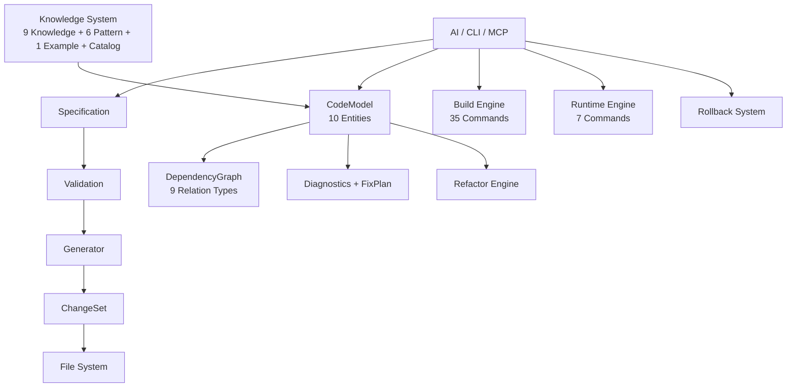

<div align="center">


</div>

<div align="center">

<pre>
   ██████╗  █████╗ ██████╗ ███████╗
  ██╔════╝ ██╔══██╗██╔══██╗██╔════╝
  ██║      ███████║██║  ██║█████╗  
  ██║      ██╔══██║██║  ██║██╔══╝  
  ╚██████╗ ██║  ██║██████╔╝███████╗
   ╚═════╝ ╚═╝  ╚═╝╚═════╝ ╚══════╝
</pre>

</div>

---

# CADE — CATIA CAA Development Engine

<div align="center">

### 🎯 AI-Powered CATIA CAA Development. *One command. Eight files. Done.*

From "I need a dialog command" to compiling code — without touching RADE wizards.

**[Quick Start](#-quick-start) · [Why CADE?](#-why-cade) · [Commands](#-what-it-can-do) · [Docs](.agents/skills/catia-caa-dev/docs/) · [中文](#-中文)**

</div>

---

## ⚡ Quick Start

```bash
# 1. Clone into your CAA project
git clone https://github.com/chenlei-gh/CADE.git
cp -r cade/.agents /path/to/your/caa/project/

# 2. That's it. Open in your editor.
#    CADE auto-detects CATIA. Zero config.
```

> [!TIP]
> **Zed** — works out of the box.  
> **Claude / Cursor / VS Code / Windsurf** — run `python .agents/skills/catia-caa-dev/tools/setup_mcp.py`

<details><summary>📋 Manual MCP setup</summary>

```json
{
  "mcpServers": {
    "cade": {
      "command": "python",
      "args": ["skills/mcp_server.py"],
      "cwd": ".agents/skills/catia-caa-dev"
    }
  }
}
```
</details>

---

## 🔥 Why CADE?

| ❌ Without CADE | ✅ With CADE |
|---|---|
| Manually create 8 files per command | `cade create command MyCmd MyModule` |
| Run RADE wizards, click through dialogs | Tell AI: "create a command with dialog" |
| `mkmk -u` then `mkCreateRuntimeView` then `CNEXT` | `cade build && cade run` |
| Guess what's broken after refactoring | `cade diagnose && cade fix --apply` |
| No way to undo a mistaken delete | `cade rollback --id latest` |

---

## 🧰 What It Can Do

### 🏗 Create
```bash
cade create command MyCmd MyModule --dialog --wb MyWb
cade create feature  MyFeature MyModule
cade create extension MyExt CATPart MyModule
```
→ Generates `.cpp`, `.h`, Header, Catalog, NLS, Icon, Dictionary, Imakefile — **all 8 files in one call**.

### 🔨 Build & Run
```bash
cade build                          # incremental (mkmk -u)
cade build --full --threads 8       # full rebuild, 8 threads
cade run                            # start CATIA Runtime View
cade run --macro test.CATScript     # run a macro
cade run --stop                     # stop all CATIA processes
```

### 🔍 Analyze & Fix
```bash
cade analyze                        # full workspace scan
cade analyze --graph                # Mermaid dependency diagram
cade diagnose                       # find issues
cade fix --apply                    # auto-fix broken references
cade validate                       # integrity check
```

### ♻️ Refactor & Rollback
```bash
cade refactor rename OldCmd NewCmd --module MyModule
cade refactor move MyCmd --from M1 --to M2
cade snapshot                     # checkpoint
cade rollback --id latest         # undo anything
```

### 🤖 AI & Docs
```bash
cade suggest                      # AI recommends next action
cade docs                         # auto-generate documentation
cade prereq MyModule              # view prerequisites
cade rv                           # create Runtime View
cade test --quick                 # run all 18 test suites (~8s)
```

> 🔌 Also available as **MCP Server** (38 tools) and **Python API** (~80 functions) — [see docs](.agents/skills/catia-caa-dev/docs/).

---

## 🏛 Architecture



> **Philosophy**: Capability grows by accumulating knowledge assets, not by modifying code.

---

## 📊 By the Numbers

| | |
|---|---|
| **Test Suites** | 18 (L1-L7 + Integration + Audit) |
| **Test Cases** | 700+ |
| **Pass Rate** | 100% |
| **Templates** | 25+ |
| **APIs** | 15 (Intent + Action) |
| **CLI Commands** | 19 |
| **MCP Tools** | 38 |
| **Build Commands** | 35 |
| **Spec Types** | 8 |
| **Refactor Operations** | 3 |
| **Domain Entities** | 10 |
| **Knowledge Assets** | 16 (9K + 6P + 1E) |

---

## 📂 Project Structure

```
your_project/
├── .agents/skills/catia-caa-dev/   ← CADE (drop-in)
│   ├── skills/                     ← Engine (22 modules)
│   ├── templates/                  ← 25+ code templates
│   ├── knowledge/                  ← CAA API reference (9 domains)
│   ├── patterns/                   ← Architecture patterns (6 types)
│   ├── examples/                   ← Real CAA projects
│   ├── tests/                      ← 18 suites, 700+ cases
│   ├── tools/                      ← Setup, validation, utilities
│   ├── config/                     ← Editor MCP templates
│   └── docs/                       ← Full documentation
├── MyFramework.edu/
├── MyModule.m/
└── ...
```

---

## 🇨🇳 中文

### 是什么？

**CADE** 是 CATIA CAA V5/V6 的 AI 驱动开发引擎。用自然语言告诉 AI "创建一个带对话框的命令"，引擎自动生成 8 个文件。一句命令替代 RADE 向导的多次点击。

```bash
cade create command 我的命令 我的模块 --dialog --wb 我的工作台
```

### ⚡ 快速开始

```bash
git clone https://github.com/chenlei-gh/CADE.git
cp -r cade/.agents /你的/CAA/项目/路径/
# 用编辑器打开项目。CADE 自动检测 CATIA，零配置。
```

> [!TIP]
> **Zed** — 开箱即用。
> **Claude / Cursor / VS Code / Windsurf** — 运行 `python .agents/skills/catia-caa-dev/tools/setup_mcp.py`

### 🔥 为什么选 CADE？

| ❌ 没有 CADE | ✅ 有 CADE |
|---|---|
| 手动创建 8 个文件 | `cade create command 我的命令 我的模块` |
| 操作 RADE 向导，多次点击 | 告诉 AI："创建一个带对话框的命令" |
| `mkmk` → `mkCreateRuntimeView` → `CNEXT` | `cade build && cade run` |
| 重构后猜测哪里坏了 | `cade diagnose && cade fix --apply` |
| 误删了没法恢复 | `cade rollback --id latest` |

### 🧰 能做什么

**🏗 创建**
```bash
cade create command  我的命令 我的模块 --dialog --wb 我的工作台
cade create feature  我的Feature 我的模块
cade create extension 我的扩展 CATPart 我的模块
```
→ 一次调用生成 .cpp、.h、Header、Catalog、NLS、Icon、Dictionary、Imakefile

**🔨 编译运行**
```bash
cade build                          # 增量编译
cade build --full --threads 8       # 全量编译
cade run                            # 启动 CATIA Runtime View
cade run --stop                     # 停止 CATIA
```

**🔍 分析修复**
```bash
cade analyze --graph                # Mermaid 依赖图
cade diagnose                       # 诊断问题
cade fix --apply                    # 自动修复
cade validate                       # 完整性检查
```

**♻️ 重构回滚**
```bash
cade refactor rename 旧命令 新命令 --module 我的模块
cade snapshot                       # 快照
cade rollback --id latest           # 撤销
```

**🤖 AI 辅助**
```bash
cade suggest                        # AI 推荐下一步
cade docs                           # 自动生成文档
cade test --quick                   # 运行 18 套件全测试
```

### 🏛 架构

```
AI / CLI / MCP
     ↓
Specification → Validation → Generator → ChangeSet → File System
     ↓
CodeModel（10 实体）+ DependencyGraph + Diagnostics + FixPlan
     ↓
Build Engine（35 命令）+ Runtime Engine（7 命令）+ Rollback
     ↓
Knowledge System（9 Knowledge + 6 Pattern + 1 Example）
```

> **核心理念**：系统能力增长靠沉淀知识资产，不靠修改代码。

### 📊 数据

| | |
|---|---|
| **测试套件** | 18（L1-L7 + Integration + Audit） |
| **测试用例** | 700+ |
| **通过率** | 100% |
| **模板** | 25+ |
| **API** | 15（Intent + Action） |
| **CLI 命令** | 19 |
| **MCP 工具** | 38 |
| **Build 命令** | 35 |
| **Spec 类型** | 8 |
| **重构操作** | 3 |
| **领域实体** | 10 |
| **知识资产** | 16（9K + 6P + 1E） |

### 📂 项目结构

```
你的项目/
├── .agents/skills/catia-caa-dev/   ← CADE（直接放入即可）
│   ├── skills/                     ← 引擎（22 模块）
│   ├── templates/                  ← 25+ 代码模板
│   ├── knowledge/                  ← CAA API 参考（9 领域）
│   ├── patterns/                   ← 架构模式（6 类型）
│   ├── examples/                   ← 真实 CAA 项目
│   ├── tests/                      ← 18 套件，700+ 用例
│   └── docs/                       ← 完整文档
├── MyFramework.edu/
├── MyModule.m/
└── ...
```

---

## 📜 License

MIT © [chenlei-gh](https://github.com/chenlei-gh)

---

<div align="center">

**[📖 Documentation](.agents/skills/catia-caa-dev/docs/) · [🏗 Architecture](.agents/skills/catia-caa-dev/docs/references/ARCHITECTURE.md) · [📝 Changelog](.agents/skills/catia-caa-dev/CHANGELOG.md)**

</div>
